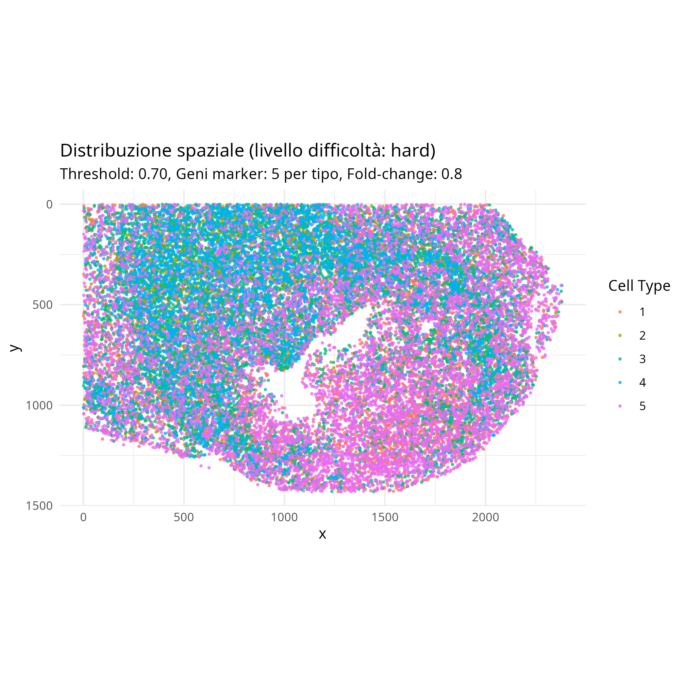

# Simulazione e Analisi di Trascrittomica Spaziale su Immagine di Granuloma

## 1. Introduzione e Obiettivi

Questo report presenta i risultati della simulazione e dell'analisi di dati di trascrittomica spaziale generati a partire dall'immagine di un granuloma. L'obiettivo principale è stato valutare le prestazioni di due metodi di clustering, Seurat e HDBSCAN, su dati simulati con diversi livelli di difficoltà: facile, medio e difficile.

La simulazione della trascrittomica spaziale rappresenta uno strumento fondamentale per comprendere le dinamiche di espressione genica in tessuti biologici complessi. In questo studio, abbiamo utilizzato un modello di simulazione parametrizzato che genera profili di espressione realistica a partire da immagini istologiche.

### Immagine di Riferimento

## 2. Metodologia

### 2.1 Pipeline di Simulazione

La simulazione è stata realizzata utilizzando `image_simulations.R`, che implementa i seguenti passaggi:

1. **Caricamento e pre-elaborazione dell'immagine**: conversione in scala di grigi e applicazione di thresholding (soglia = 0.7).
2. **Clustering dei pixel** basato sull'intensità usando kmeans++ con 5 cluster.
3. **Campionamento delle cellule**: distribuzione proporzionale di 30.000 cellule nei cluster identificati.
4. **Generazione dei profili di espressione**: utilizzo di un modello di distribuzione Negative Binomial.
5. **Simulazione di dropout spaziale**: modellazione di fenomeni di dropout.
6. **Visualizzazione**: generazione di plot per rappresentare la distribuzione spaziale.

### 2.2 Parametri di Simulazione

La simulazione è stata eseguita con i seguenti parametri comuni:
- **Numero di cellule**: 30.000
- **Numero di geni**: 100
- **Tipi cellulari**: 5
- **Threshold**: 0.7

I parametri specifici per ogni livello di difficoltà sono:

| Parametro | Easy | Medium | Hard |
|-----------|------|--------|------|
| Geni marker per tipo | 10 | 7 | 5 |
| Fold-change espressione marker | 2.0 | 1.2 | 0.8 |
| Overlapping tra tipi | 0.0 | 0.2 | 0.4 |
| Rumore spaziale | 0.5 | 1.0 | 1.5 |
| Range correlazione spaziale | 50 | 30 | 15 |
| Rumore casuale (SD) | 0.1 | 0.2 | 0.4 |
| Range dropout | 0.1-0.3 | 0.2-0.5 | 0.3-0.7 |
| Range dispersione | 3.0-1.5 | 2.0-1.0 | 1.5-0.8 |
| Rumore cellula-specifico (SD) | 0.1 | 0.2 | 0.3 |

### 2.3 Analisi dei Cluster

L'analisi è stata condotta utilizzando `analyze_and_compare_clusters.R`, che implementa:

1. **Creazione dell'oggetto Seurat**: importazione dei dati simulati.
2. **Normalizzazione**: utilizzo di SCTransform.
3. **Riduzione dimensionale**: PCA e UMAP.
4. **Clustering con Seurat**: parametrizzato con risoluzione 0.3.
5. **Clustering con HDBSCAN**: applicato sulle embeddings UMAP con minPts=10.
6. **Valutazione**: calcolo delle metriche di performance (TP, FP, FN, Precision).

## 3. Risultati della Simulazione

### 3.1 Distribuzione Spaziale dei Cluster

Le seguenti figure mostrano la distribuzione spaziale delle cellule simulate nei 5 tipi cellulari identificati per ciascun livello di difficoltà:

**Livello Easy**:

**Livello Medium**:

**Livello Hard**:

Come si può osservare, tutti e tre i livelli di difficoltà mantengono la struttura anatomica del granuloma, ma presentano caratteristiche di clustering diverse in base ai parametri utilizzati. Si noti che, malgrado la differenza nei parametri, la distribuzione spaziale risulta visivamente simile a causa della discretizzazione delle cellule.

### 3.2 Caratteristiche dei Dati Simulati

I dati simulati presentano le seguenti caratteristiche principali che variano in base al livello di difficoltà:

- **Easy**: Cluster ben separati con marker fortemente espressi (fold-change 2.0), basso dropout (10-30%) e basso rumore.
- **Medium**: Cluster con sovrapposizione moderata, marker con espressione intermedia (fold-change 1.2), dropout moderato (20-50%) e rumore medio.
- **Hard**: Cluster con alta sovrapposizione, marker con espressione debole (fold-change 0.8), alto dropout (30-70%) e rumore elevato.

## 4. Risultati dell'Analisi dei Cluster

### 4.1 Confronto delle Performance: Seurat vs HDBSCAN

La tabella seguente riassume le performance complessive dei due metodi di clustering sui tre livelli di difficoltà:

| Livello | Metodo | True Positives | False Positives | False Negatives | Precision |
|---------|--------|----------------|-----------------|-----------------|-----------|
| Easy    | Seurat | 29736          | 264             | 264             | 0.9912    |
| Easy    | HDBSCAN| 29720          | 280             | 280             | 0.9907    |
| Medium  | Seurat | 3467           | 26533           | 26533           | 0.1156    |
| Medium  | HDBSCAN| 4981           | 25019           | 25019           | 0.1660    |
| Hard    | Seurat | 3743           | 26257           | 26257           | 0.1248    |
| Hard    | HDBSCAN| 8177           | 21823           | 21823           | 0.2726    |

#### Dettaglio per Livello Easy

| Metodo | Cluster | True Positives | False Positives | Precision |
|--------|---------|----------------|-----------------|-----------|
| Seurat | cells_a | 8114           | 73              | 0.9911    |
| Seurat | cells_b | 7332           | 49              | 0.9934    |
| Seurat | cells_c | 7052           | 84              | 0.9882    |
| Seurat | cells_d | 4992           | 44              | 0.9913    |
| Seurat | cells_e | 2246           | 14              | 0.9938    |
| HDBSCAN| cells_a | 8112           | 79              | 0.9904    |
| HDBSCAN| cells_b | 7332           | 50              | 0.9932    |
| HDBSCAN| cells_c | 7046           | 78              | 0.9891    |
| HDBSCAN| cells_d | 4978           | 36              | 0.9928    |
| HDBSCAN| cells_e | 2252           | 37              | 0.9838    |

#### Dettaglio per Livello Medium

| Metodo | Cluster | True Positives | False Positives | Precision |
|--------|---------|----------------|-----------------|-----------|
| Seurat | cells_a | 1003           | 6699            | 0.1302    |
| Seurat | cells_b | 191            | 6916            | 0.0269    |
| Seurat | cells_c | 201            | 6190            | 0.0315    |
| Seurat | cells_d | 203            | 5796            | 0.0338    |
| Seurat | cells_e | 1869           | 932             | 0.6673    |
| HDBSCAN| cells_a | 4447           | 11484           | 0.2791    |
| HDBSCAN| cells_b | 132            | 2274            | 0.0549    |
| HDBSCAN| cells_c | 15             | 607             | 0.0241    |
| HDBSCAN| cells_d | 385            | 46              | 0.8933    |
| HDBSCAN| cells_e | 2              | 411             | 0.0048    |

#### Dettaglio per Livello Hard

| Metodo | Cluster | True Positives | False Positives | Precision |
|--------|---------|----------------|-----------------|-----------|
| Seurat | cells_a | 2851           | 7937            | 0.2643    |
| Seurat | cells_b | 548            | 1403            | 0.2809    |
| Seurat | cells_c | 171            | 1165            | 0.1280    |
| Seurat | cells_d | 119            | 1162            | 0.0929    |
| Seurat | cells_e | 54             | 1208            | 0.0428    |
| HDBSCAN| cells_a | 8091           | 21587           | 0.2726    |
| HDBSCAN| cells_b | 84             | 228             | 0.2692    |
| HDBSCAN| cells_c | 2              | 8               | 0.2000    |
| HDBSCAN| cells_d | 0              | 0               | NA        |
| HDBSCAN| cells_e | 0              | 0               | NA        |

## 5. Discussione e Interpretazione

### 5.1 Performance sul Dataset Easy

Entrambi i metodi di clustering hanno ottenuto performance eccellenti sul dataset Easy, con precisione superiore al 99%. Questo era prevedibile dato l'alto segnale (fold-change 2.0) e il basso rumore del dataset. Le differenze tra Seurat e HDBSCAN sono minime, suggerendo che in condizioni ottimali entrambi gli algoritmi sono egualmente efficaci.

### 5.2 Performance sul Dataset Medium

Sul dataset Medium, la performance di entrambi i metodi è calata drasticamente, ma HDBSCAN ha dimostrato una precisione complessiva leggermente superiore (16.6% vs 11.6%). Le principali differenze si osservano nei cluster cells_a e cells_d, dove HDBSCAN ha ottenuto sia più True Positives che una precisione più alta. È interessante notare come Seurat abbia identificato meglio il cluster cells_e.

### 5.3 Performance sul Dataset Hard

Nel dataset Hard, la differenza tra i due metodi diventa ancora più evidente. HDBSCAN ha ottenuto una precisione complessiva del 27.3% contro il 12.5% di Seurat, con un numero di True Positives più che doppio. Tuttavia, HDBSCAN non è riuscito a identificare i cluster cells_d e cells_e, mentre Seurat ha comunque trovato alcune cellule correttamente classificate in questi cluster.

### 5.4 Confronto dei Metodi

Riassumendo le performance sui tre dataset:

1. **Seurat**:
   - Prestazioni eccellenti su dati ben separati (Easy)
   - Identificazione più uniforme dei cluster anche in condizioni difficili
   - Maggiore sensibilità ai tipi cellulari rari
   - Rapido calo della precisione all'aumentare della difficoltà

2. **HDBSCAN**:
   - Prestazioni simili a Seurat su dati ben separati
   - Maggiore robustezza al rumore in condizioni intermedie e difficili
   - Tendenza a concentrarsi sui cluster principali in condizioni difficili
   - Migliore precisione complessiva nei dataset più complessi

### 5.5 Implicazioni e Limitazioni del Modello di Simulazione

Il modello di simulazione utilizzato si è dimostrato efficace nel generare dati che riflettono la complessità dei dataset reali di trascrittomica spaziale, con le seguenti caratteristiche:

1. **Correlazione spaziale**: il modello cattura efficacemente la correlazione spaziale dell'espressione genica.
2. **Dropout spaziale**: la simulazione del dropout basato sulla densità locale simula realisticamente gli artefatti tecnici.
3. **Parametrizzazione flessibile**: la possibilità di regolare numerosi parametri consente di testare i metodi in diverse condizioni.

Tuttavia, il modello presenta alcune limitazioni:
- La distribuzione spaziale dei tipi cellulari è basata solo sull'intensità dell'immagine
- Non considera interazioni complesse tra geni e pathways biologici
- Semplifica la variabilità biologica reale

## 6. Conclusioni

Questa analisi comparativa ha dimostrato che le performance dei metodi di clustering in trascrittomica spaziale dipendono fortemente dalla qualità dei dati. In particolare:

1. **Su dati di alta qualità** (pochi dropout, forte espressione dei marker), sia Seurat che HDBSCAN offrono risultati eccellenti e quasi indistinguibili.

2. **Su dati di media e bassa qualità**, HDBSCAN tende a mostrare una precisione complessiva superiore, ma con una tendenza a concentrarsi sui cluster principali e a ignorare i tipi cellulari più rari.

3. **Seurat** mostra una maggiore capacità di identificare cluster anche in condizioni difficili, ma con un più alto tasso di falsi positivi.

Queste osservazioni suggeriscono che **la scelta del metodo di clustering dovrebbe basarsi sulle caratteristiche specifiche del dataset** e sugli obiettivi dell'analisi:
- Se si cercano tutti i possibili tipi cellulari, anche quelli rari, Seurat potrebbe essere preferibile.
- Se si mira ad alta precisione nei cluster principali, HDBSCAN potrebbe essere la scelta migliore.

Il modello di simulazione sviluppato rappresenta uno strumento prezioso per confrontare metodi di analisi in condizioni controllate, permettendo di comprendere meglio le loro forze e limitazioni prima dell'applicazione a dati reali.