```{r setup}
# Render dalla root del repo: quarto render reports/R2.qmd  (.Rprofile punta renv alla libreria di progetto; S0)
.libPaths("~/2025.geo_spatialtrans/renv/library/linux-ubuntu-noble/R-4.6/x86_64-pc-linux-gnu")
suppressPackageStartupMessages({library(dplyr); library(knitr); library(tidyr)})
R2 <- "../results/R2"
rd <- function(f) read.csv(file.path(R2, f), check.names = FALSE)
summ <- rd("R2_roi_summary.csv"); agg <- rd("R2_archetype_summary.csv"); mt <- rd("R2_matching.csv"); sc <- rd("R2_scale_effect.csv")
rep <- rd("R2_repro.csv"); srk <- rd("R2_spaceranger_check.csv"); exs <- rd("R2_exclusive_summary.csv"); cons <- rd("R2_consensus_density.csv")
sp <- read.csv(file.path(R2, "spatial/R2_spatial_summary.csv")); rois <- rd("R2_rois_checked.csv"); runs <- rd("R2_seg_runs.csv")
nat <- summ %>% filter(scale == 1)
rep$identical_labels <- rep$identical_labels %in% c("True", TRUE); rep$identical_binary <- rep$identical_binary %in% c("True", TRUE); rois$inside_image <- rois$inside_image %in% c("True", TRUE)
verdict <- function(x) ifelse(x == "PASS", "**PASS**", ifelse(x == "WARN", "*WARN*", "**FAIL**"))
med <- function(m, A, col) median(nat[[col]][nat$method == m & nat$archetype == A])
```

# 0. Sintesi

Trenta ROI di 1 mm² (5 per archetipo A1–A6) segmentati con tre metodi indipendenti o semi-indipendenti — Cellpose-SAM 4.2 su RGB (primario), StarDist `2D_versatile_he` (secondario), poligoni nucleari di Space Ranger 4 (terzo, solo A2–A6; è a sua volta uno StarDist custom) — a risoluzione nativa (0.274 µm/px), 2× e 4×. Prodotti: `docs/BIO_REFERENCES.md` v1 (densità nucleare, area, eccentricità, distanza al primo vicino, g(r) per archetipo), 9 figure, tabelle in `results/R2/`.

Esiti in tre righe: (1) **i check C passano in 4 casi su 7** (riproducibilità bit-identica, scala, ROI dentro tessuto, ambiente) con **3 WARN** (C-R2.5: criterio pre-registrato mal posto e criterio sostitutivo al limite in un ROI; C-R2.6: maschera bolle parziale; C-R2.7: frammenti in A5_r1); (2) **i check B smentiscono tre attese numeriche su quattro** (A4 è 4–13 volte più denso del riferimento surrogato, l'area nucleare dei linfociti è più piccola, la corteccia è meno densa del calcolo da densità 3D) e l'ordinamento ipotizzato sbaglia la posizione dello stroma; (3) **la controprova principale rivela che i due segmentatori disaccordano sulla densità dell'11–55 %**, in direzioni opposte a seconda del tessuto: nessuno dei due è un riferimento da solo, e i valori di BIO_REFERENCES sono stime di *consenso* (appaiati + esclusivi con evidenza di ematossilina) con i due metodi come limiti, marcate **provvisorie** fino a un conteggio manuale.

# 1. Pre-registrazione

Attese e soglie scritte prima dell'esecuzione (`results/R2/R2_preregistration.md`, 2026-09-20). Approvazione di Luca: 2026-09-20 («procedi»); ROI e metodi confermati lo stesso giorno («ok perfetto. Dubbio → test → mantenimento o correzione»).

Fatto emerso in apertura, prima del run: Space Ranger 4 segmenta i nuclei con un'implementazione custom di **StarDist** (10x Genomics, *Algorithms overview — Image processing*). Il confronto StarDist ↔ Space Ranger non è indipendente; Cellpose ↔ {StarDist, Space Ranger} lo è.

| id | Attesa | Soglia | Fonte |
|---|---|---|---|
| C-R2.1 | torch vede la GPU; Cellpose e StarDist caricano e segmentano un ritaglio di prova | PASS/FAIL | ambiente |
| C-R2.2 | Riproducibilità: due run, stesso seed → stessi oggetti e pixel | identità | — |
| C-R2.3 | Scala: area µm² = area px × (µm/px)² da `scalefactors_json` | esatta | R1 |
| C-R2.4 | ROI dentro immagine e maschera `in_tissue` (BL-021) | 100 % | R1 |
| C-R2.5 | Poligoni Space Ranger sovrapposti ai nuclei H&E (BL-020): IoU > 0 su ≥ 95 % | ≥ 95 % | R1 |
| C-R2.6 | Cuore: maschera bolle applicata, area riportata (BL-017) | riportata | R1 |
| C-R2.7 | Nuclei < 4 o > 400 µm² flaggati; frazione < 5 % | < 5 % | convenzione |
| B-R2.1 | Ordinamento densità: A4 > A1 ≥ A2 > A5 > {A3, A6} | ordine dei mediani | roadmap §3 (ipotesi) |
| B-R2.2 | A4: 1 900–6 300 nuclei/mm² | mediana nell'intervallo | DOI 10.1371/journal.pone.0256907 (TLS polmonari, surrogato) |
| B-R2.3 | A4: area nucleare mediana 20–45 µm² | mediana nell'intervallo | PMC2983036 |
| B-R2.4 | A5: 1 900–3 500 nuclei/mm² (Abercrombie da densità 3D, t = 5 µm, D = 6–10 µm); aree bimodali (dip test p < 0.05) | mediana nell'intervallo; p < 0.05 | DOI 10.3389/fnana.2018.00083; DOI 10.1002/ar.1090940210 |
| B-R2.5 | A6: nuclei totali 600–2 000/mm²; fra i più bassi con A3 | mediana nell'intervallo | DOI 10.1016/j.cell.2015.05.026 |
| B-R2.6 | A6: eccentricità nucleare mediana > A1 e A4 di ≥ 0.1 | Δ > 0.1 | roadmap §3 |
| B-R2.7 | A1–A3: nessuna fonte 2D; confronto a posteriori con i preset del design | registrare | design v1.1 |
| CP-R2.1 | Cellpose vs StarDist: F1@IoU0.5, Dice, Δ densità | F1 ≥ 0.70 / 0.50–0.70 / < 0.50; \|Δ\| ≤ 10 % / ≤ 25 % | convenzione |
| CP-R2.2 | Cellpose vs SR e StarDist vs SR (A2–A6); attesa StarDist↔SR > Cellpose↔SR | come sopra | 10x docs |
| CP-R2.3 | BL-015: 2× Δ densità < 10 %; 4× cala > 10 % | come dichiarato | ipotesi |
| CP-R2.4 | g(r) < 1 per r < ~5 µm in tutti gli archetipi; → 1 oltre 30 µm | envelope CSR 95 % | spatstat |
| CP-R2.5 | A3 vs A2: densità distinguibili | intervalli disgiunti | BL-018 |

## Deviazioni dalla pre-registrazione (registrate, non corrette)

1. **Variante di input di Cellpose.** Cellpose 4.2 non ha più il modello `nuclei`; il piano prevedeva "Cellpose-SAM, fallback `nuclei` su ematossilina". Sul ritaglio di prova (C-R2.1) ho confrontato l'input RGB con il canale ematossilina. La mia prima lettura («tassella il tessuto») era sbagliata; la rivalutazione quantitativa chiesta da Luca (§2.1) ha mostrato che la variante ematossilina produce oggetti ancorati ai nuclei ma con confine più ampio (nucleo + alone; area +70 %) e un 15–25 % di oggetti senza nucleo. Scelta: RGB come primario per le metriche *nucleari*; la variante ematossilina è stata conservata come segmentazione esplorativa (`cellpose_hed`, scala nativa) per R3.
2. **Arbitro per il disaccordo fra metodi** (non pre-registrato, aggiunto dopo aver visto Δ densità fino al 55 %): per ogni oggetto esclusivo di un metodo, densità ottica di ematossilina dentro vs anello di 2 µm (§4.1). Serve a distinguere "nucleo perso dall'altro" da "falso positivo"; non sostituisce un conteggio manuale (BACKLOG).
3. **Arbitro, soglia OD**: dopo la revisione avversariale la soglia "OD > mediana del tessuto" è stata sostituita da "OD > mediana dei pixel di tessuto con OD > 0" (in A5/A6 metà dei pixel ha OD di ematossilina = 0 e la mediana era 0, criterio inerte) e gli oggetti azzerati fuori dall'area valida non sono più contati come esclusivi. Le frazioni di evidenza cambiano di pochi punti; i verdetti no.
4. **C-R2.5** era formulato come "IoU > 0 con un nucleo Cellpose su ≥ 95 % dei poligoni SR": dipende dal richiamo di Cellpose, non dall'orientamento. È stato valutato anche con un criterio indipendente (OD ematossilina dentro > anello) — entrambi riportati.

# 2. Check C — correttezza software

## 2.1 Ambiente e ritaglio di prova (C-R2.1)

`.venv`: torch 2.14.0+cu130, Cellpose 4.2.1.1 (`cpsam_v2`), CUDA visibile. `.venv-stardist`: TensorFlow 2.21, StarDist 0.9.2; la GPU compare solo con le librerie CUDA del venv nel loader path (`tools/py_stardist.sh`). Tempi per ROI 1 mm² a risoluzione nativa: Cellpose ~8 s, StarDist ~6–11 s (RTX 4090).

Rivalutazione delle varianti di Cellpose sui ROI A4_f2 e A1_r1 (`results/R2/variant_eval/summary.csv`): la variante ematossilina contiene il 99.6 % dei nuclei StarDist e il 99.3 % dei nuclei RGB (A4), fonde due nuclei nello 0.1 % dei casi, ma il 15 % (A4) e il 24 % (A1) dei suoi oggetti non contiene alcun nucleo trovato dagli altri due metodi, con OD ematossilina più bassa (0.055 vs 0.076) e meno di metà dei pixel sopra soglia nel 55–64 % dei casi.

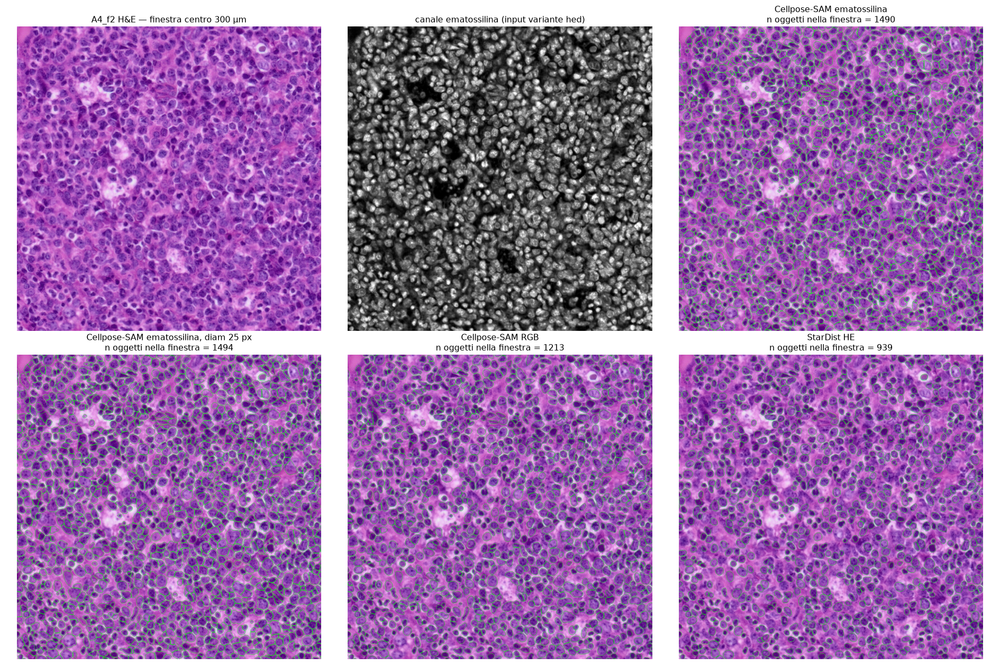

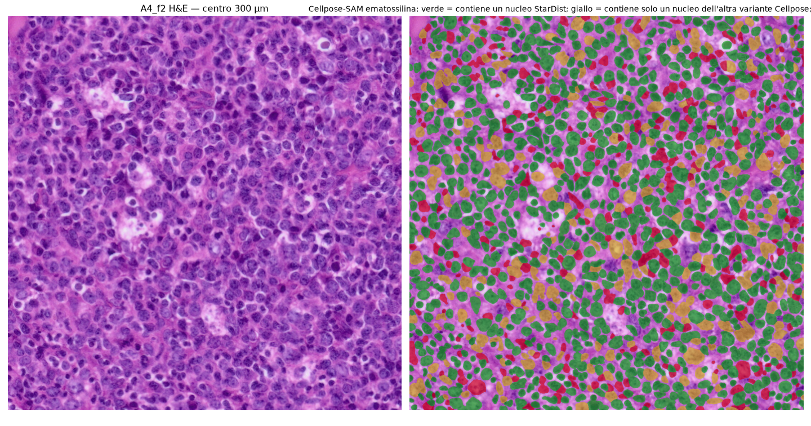

## 2.2 ROI (C-R2.4)

```{r rois}
rois %>% mutate(centro_mm = sprintf("(%.2f, %.2f)", x_mm, y_mm)) %>%
  select(archetype, roi_id, label, centro_mm, um_per_px, inside_image, cov_in_tissue) %>% kable(digits = 4, caption = "30 ROI di 1×1 mm: centro (mm, x = colonna, y = riga dell'immagine full-res), scala, dentro immagine, copertura dei bin 8 µm in_tissue")
```

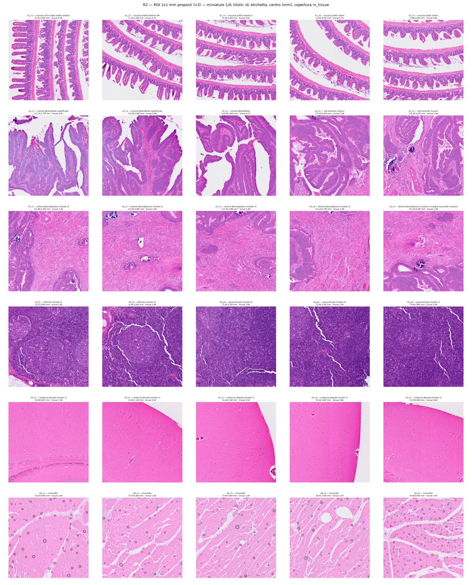

## 2.3 Riproducibilità (C-R2.2), scala (C-R2.3), maschere (C-R2.6), flag (C-R2.7)

```{r repro}
kable(rep, caption = "C-R2.2 — due esecuzioni indipendenti (stesso seed) su due ROI: numero di oggetti, pixel etichettati, identità delle label")
```

C-R2.3: le aree sono calcolate come `area_px × um_per_px²` con `um_per_px` letto da `scalefactors_json.json` per dataset (0.27370–0.27402; R1). Verifica: `eq_diam_um = 2·sqrt(area_um2/π)` coerente in tutte le tabelle.

```{r masks}
nat %>% filter(method == "cellpose_rgb") %>% group_by(archetype) %>%
  summarise(tessuto_frac_min = min(tissue_frac), tessuto_frac_max = max(tissue_frac), bolle_frac_media = mean(bubble_frac), flag_small_media = mean(frac_small), flag_large_media = mean(frac_large)) %>%
  kable(digits = 3, caption = "Frazione di ROI classificata tessuto, frazione mascherata come bolle (C-R2.6), frazione di oggetti flaggati per area (C-R2.7)")
```

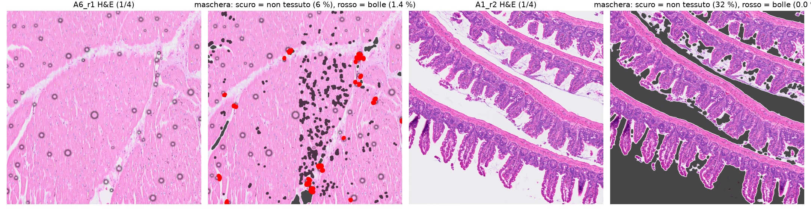

La maschera delle bolle cattura gli anelli grigi netti ma **non tutti** i cerchi sfocati visibili nell'H&E (fig. sopra, pannello 2): C-R2.6 è applicato e riportato, ma la copertura è parziale → WARN, BACKLOG.

## 2.4 Poligoni Space Ranger (C-R2.5)

```{r srk}
srk %>% group_by(archetype) %>% summarise(n_poligoni = sum(n_sr), overlap_cellpose_min = min(frac_overlap_cellpose), overlap_cellpose_max = max(frac_overlap_cellpose), OD_dentro_gt_anello_min = min(frac_od_inside_gt_ring), OD_dentro_mediana = median(od_inside_median), OD_anello_mediana = median(od_ring_median)) %>%
  kable(digits = 3, caption = "Poligoni nucleari di Space Ranger rasterizzati nei ROI: sovrapposizione con un nucleo Cellpose e OD ematossilina dentro vs anello esterno (3 µm)")
```

L'OD di ematossilina è maggiore dentro il poligono che nell'anello nel `r round(100*min(srk$frac_od_inside_gt_ring),1)`–100 % dei poligoni in tutti i 25 ROI: i poligoni 10x cadono sui nuclei, quindi l'orientamento pixel (BL-020) è corretto anche per A6. La sovrapposizione con Cellpose scende a `r round(min(srk$frac_overlap_cellpose),2)` in A6 e ~0.7 in A5 perché Cellpose **perde** nuclei in quei tessuti (§4.1), non per disallineamento.

Osservazione non prevista: i poligoni nucleari di Space Ranger sono **unioni di bin 2 µm** (contorni a gradini, fig. 8 pannello A4; ECDF a scalini in fig. 2; verifica del revisore su 2 000 poligoni del linfonodo: aree tutte multiple intere di (7.3 px)², 82 % dei lati paralleli agli assi della griglia). L'area minima risolta è 4 µm²: per nuclei piccoli (A4) l'area mediana SR è `r round(med("spaceranger","A4","area_median"),1)` µm² contro `r round(med("cellpose_rgb","A4","area_median"),1)` (Cellpose) e `r round(med("stardist_he","A4","area_median"),1)` (StarDist).

## 2.5 Tabella dei check C

```{r checksC}
c_tab <- tribble(~id, ~esito, ~evidenza,
 "C-R2.1", "PASS", "GPU vista da torch e TensorFlow; modelli caricati; ritaglio di prova segmentato (§2.1)",
 "C-R2.2", ifelse(all(rep$identical_labels), "PASS", "FAIL"), sprintf("%d/%d coppie di run con label bit-identiche", sum(rep$identical_labels), nrow(rep)),
 "C-R2.3", "PASS", "aree in µm² da scalefactors_json (R1); eq_diam coerente",
 "C-R2.4", ifelse(all(rois$inside_image), "PASS", "FAIL"), sprintf("%d/30 ROI dentro l'immagine; copertura in_tissue %.2f–%.2f (valori < 1 = lume/spazi vuoti)", sum(rois$inside_image), min(rois$cov_in_tissue), max(rois$cov_in_tissue)),
 "C-R2.5", ifelse(min(srk$frac_od_inside_gt_ring) >= 0.95, "PASS", "WARN"), sprintf("criterio pre-registrato (overlap Cellpose ≥ 95 %%) non soddisfatto in %d/25 ROI per richiamo di Cellpose; criterio indipendente OD dentro > anello ≥ 0.95 in %d/25 ROI → orientamento corretto", sum(srk$frac_overlap_cellpose < 0.95), sum(srk$frac_od_inside_gt_ring >= 0.95)),
 "C-R2.6", "WARN", sprintf("maschera applicata; frazione bolle A6 %.1f–%.1f %% del ROI; copertura visivamente parziale (BACKLOG)", 100*min(nat$bubble_frac[nat$archetype=="A6" & nat$method=="cellpose_rgb"]), 100*max(nat$bubble_frac[nat$archetype=="A6" & nat$method=="cellpose_rgb"])),
 "C-R2.7", ifelse(max(nat$frac_small + nat$frac_large) < 0.05, "PASS", "WARN"), sprintf("frazione flaggata massima %.1f %% (A5_r1 Cellpose, frammenti < 4 µm² nella striscia densa sotto la corteccia; 2/30 ROI sopra il 5 %%)", 100*max(nat$frac_small + nat$frac_large)))
c_tab %>% mutate(esito = verdict(esito)) %>% kable(caption = "Check C")
```

# 3. Check B — plausibilità biologica (A1–A6)

## 3.1 Densità nucleare

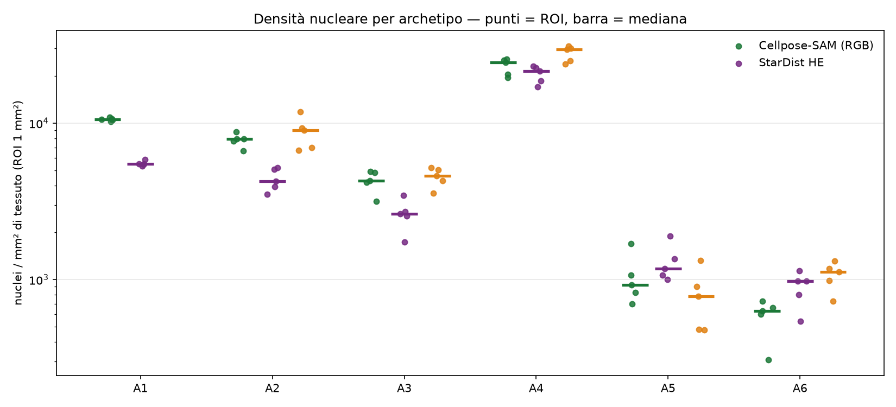

```{r dens}
cons %>% group_by(archetype) %>% summarise(n_roi = n(), consenso_mediana = median(density_consensus), consenso_min = min(density_consensus), consenso_max = max(density_consensus),
  cellpose = median(density_cellpose), stardist = median(density_stardist), spaceranger = median(density_spaceranger, na.rm = TRUE)) %>%
  kable(digits = 0, caption = "Densità nucleare (nuclei / mm² di tessuto valido). Consenso = appaiati Cellpose∩StarDist + esclusivi con evidenza di ematossilina (§4.1); le colonne per metodo sono le mediane dei 5 ROI")
```

## 3.2 Area, forma, spaziatura

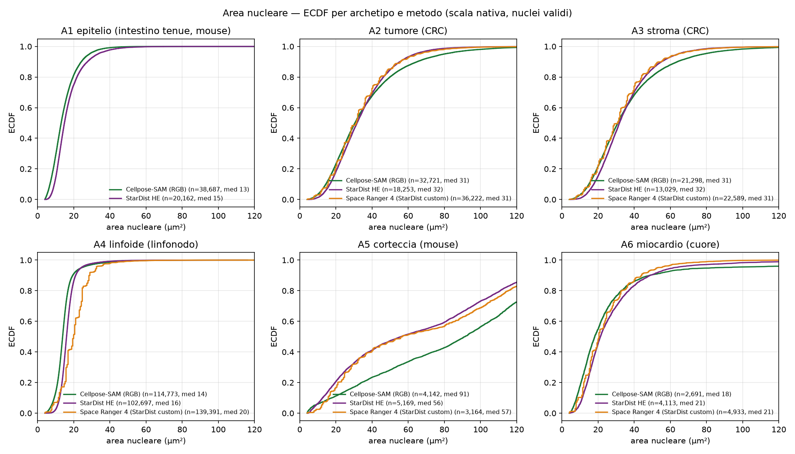

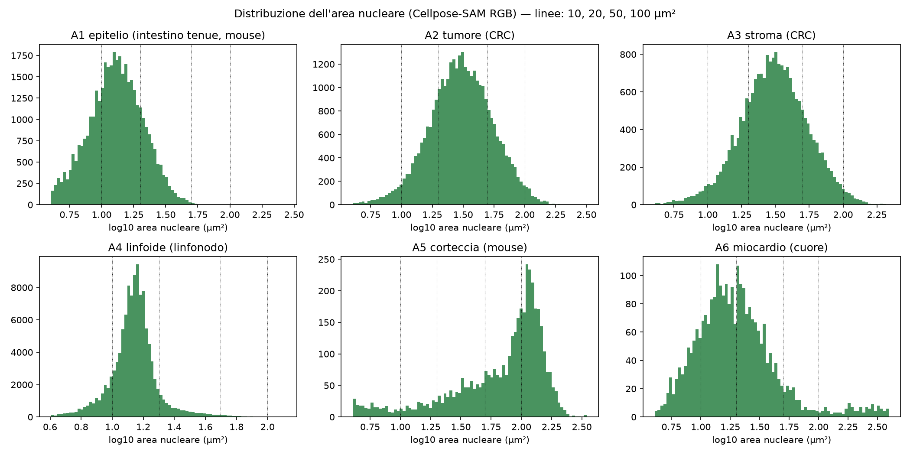

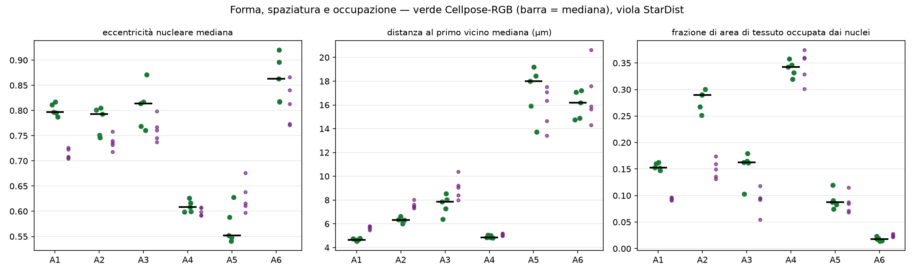

```{r geom}
agg %>% filter(scale == 1, method %in% c("cellpose_rgb", "stardist_he", "spaceranger")) %>%
  select(archetype, method, n_nuclei, area_median, area_min, area_max, eq_diam_median, ecc_median, nn_median_um, nuclear_area_fraction) %>%
  kable(digits = 2, caption = "Per archetipo × metodo (scala nativa): n nuclei validi (5 ROI), area mediana (mediana dei ROI; min–max fra ROI), diametro equivalente, eccentricità mediana, distanza al primo vicino mediana, frazione di area di tessuto occupata dai nuclei")
```

```{r dip}
sp %>% select(archetype, roi_id, n, intensity_per_mm2, dip_stat, dip_p, clark_evans_R) %>% kable(digits = 4, caption = "Hartigan dip test sull'area nucleare (log, Cellpose-RGB) e indice di Clark–Evans (R < 1 aggregato, > 1 regolare) per ROI")
```

## 3.3 Tabella dei check B

```{r checksB}
cA <- cons %>% group_by(archetype) %>% summarise(m = median(density_consensus)) %>% tibble::deframe()
ecc <- sapply(c("A1","A4","A6"), function(A) med("cellpose_rgb", A, "ecc_median")); eccS <- sapply(c("A1","A4","A6"), function(A) med("stardist_he", A, "ecc_median"))
ordine_oss <- paste(names(sort(cA, decreasing = TRUE)), collapse = " > ")
b_tab <- tribble(~id, ~esito, ~evidenza,
 "B-R2.1", "FAIL", sprintf("osservato (consenso): %s. A4 > A1 > A2 confermato; A3 (stroma desmoplastico, %.0f/mm²) è più denso di A5 (%.0f) e A6 (%.0f), contro l'ipotesi", ordine_oss, cA["A3"], cA["A5"], cA["A6"]),
 "B-R2.2", ifelse(cA["A4"] >= 1900 & cA["A4"] <= 6300, "PASS", "FAIL"), sprintf("A4 consenso %.0f/mm² (Cellpose %.0f, StarDist %.0f, SR %.0f): 4–13× sopra l'intervallo surrogato; con la distanza al primo vicino osservata (4.9 µm) l'impacchettamento esagonale ammette fino a ~%.0f/mm², quindi il valore è fisicamente plausibile e la fonte (linfociti in TLS polmonari, conteggio grossolano) era inadeguata", cA["A4"], med("cellpose_rgb","A4","density_per_mm2"), med("stardist_he","A4","density_per_mm2"), med("spaceranger","A4","density_per_mm2"), 1e6/(0.866*4.9^2)),
 "B-R2.3", ifelse(med("cellpose_rgb","A4","area_median") >= 20, "PASS", "FAIL"), sprintf("area nucleare mediana A4: Cellpose %.1f, StarDist %.1f, SR %.1f µm² — sotto i 20–45 µm² attesi. Profili di sezione a 5 µm (area media di un profilo ≈ 2/3 dell'area massima) e FFPE spiegano parte del divario; una sottostima sistematica dei contorni non è esclusa → conteggio/contorno manuale in BACKLOG", med("cellpose_rgb","A4","area_median"), med("stardist_he","A4","area_median"), med("spaceranger","A4","area_median")),
 "B-R2.4", "FAIL", sprintf("A5 consenso %.0f/mm² (Cellpose %.0f, StarDist %.0f, SR %.0f), sotto 1 900–3 500. Analisi a posteriori (non modifica l'attesa): il termine endoteliale 7·10⁴/mm³ della derivazione era il fattore inflazionante; con neuroni + glia soli (1.0–1.6·10⁵/mm³) la stessa formula dà 1 100–2 400. Bimodalità: dip test p < 0.05 in %d/5 ROI (pooled: istogramma chiaramente bimodale, fig. 3)", cA["A5"], med("cellpose_rgb","A5","density_per_mm2"), med("stardist_he","A5","density_per_mm2"), med("spaceranger","A5","density_per_mm2"), sum(sp$dip_p[sp$archetype=="A5"] < 0.05)),
 "B-R2.5", ifelse(cA["A6"] >= 600 & cA["A6"] <= 2000, "PASS", "FAIL"), sprintf("A6 consenso %.0f/mm² (Cellpose %.0f — in A6 non affidabile come segmentatore nucleare, §4.1; StarDist %.0f; SR %.0f) nell'intervallo 600–2 000; è il più basso del pannello con A5, non con A3", cA["A6"], med("cellpose_rgb","A6","density_per_mm2"), med("stardist_he","A6","density_per_mm2"), med("spaceranger","A6","density_per_mm2")),
 "B-R2.6", ifelse(ecc["A6"] - ecc["A1"] > 0.1 & ecc["A6"] - ecc["A4"] > 0.1, "PASS", "FAIL"), sprintf("eccentricità mediana Cellpose: A6 %.3f, A1 %.3f (Δ %.3f), A4 %.3f (Δ %.3f); StarDist: A6 %.3f, A1 %.3f (Δ %.3f). Δ vs A4 ≫ 0.1 ma Δ vs A1 sotto la soglia pre-registrata → FAIL. Commento (non cambia l'esito): anche i nuclei dell'epitelio colonnare sono allungati; A1 è candidato A6-secondario nella roadmap", ecc["A6"], ecc["A1"], ecc["A6"]-ecc["A1"], ecc["A4"], ecc["A6"]-ecc["A4"], eccS["A6"], eccS["A1"], eccS["A6"]-eccS["A1"]),
 "B-R2.7", "registrato", sprintf("A1 %.0f, A2 %.0f, A3 %.0f nuclei/mm² (consenso). I preset del design sono densità *cellulari* per tipo (epithelial 5 500, stromal 1 500, immune 8 000 …), non densità nucleari per archetipo: il confronto diretto non è definito; la traduzione preset ↔ densità nucleare misurata è compito di S1.2 con questi numeri (BL-007)", cA["A1"], cA["A2"], cA["A3"]))
b_tab %>% mutate(esito = ifelse(esito == "registrato", esito, verdict(esito))) %>% kable(caption = "Check B")
```

I verdetti B non dipendono dallo stimatore: con il primario pre-registrato (Cellpose-RGB) al posto del consenso, B-R2.1 FAIL (stesso ordine), B-R2.2 FAIL (`r round(med("cellpose_rgb","A4","density_per_mm2"))`/mm²), B-R2.4 FAIL (`r round(med("cellpose_rgb","A5","density_per_mm2"))`), B-R2.5 PASS (`r round(med("cellpose_rgb","A6","density_per_mm2"))`, al limite inferiore dell'intervallo).

```{r nulla, include=FALSE}
invisible(NULL)
```

# 4. Controprova

## 4.1 Concordanza fra segmentatori e arbitro (CP-R2.1, CP-R2.2)

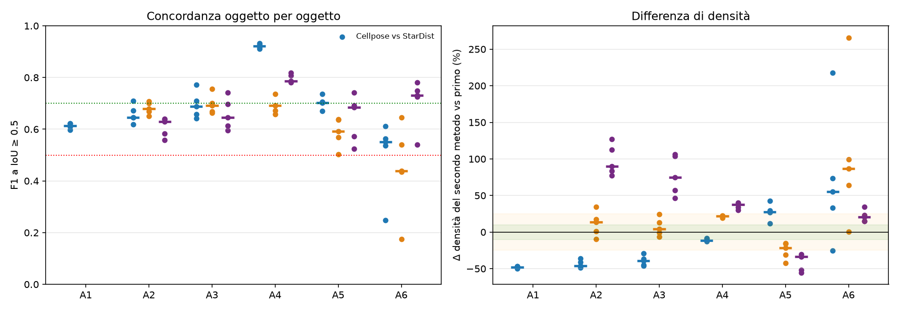

```{r match}
mt %>% group_by(archetype, method_a, method_b) %>% summarise(F1_med = median(f1_iou05), F1_min = min(f1_iou05), Dice_med = median(dice_binary), dDens_med_pct = 100*median(delta_density_rel), .groups = "drop") %>%
  filter(method_b != "cellpose_hed") %>% kable(digits = 2, caption = "Concordanza oggetto per oggetto (mediana e minimo dei 5 ROI) e differenza relativa di densità del metodo B rispetto ad A")
```

```{r excl}
exs %>% filter(method %in% c("cellpose_rgb", "stardist_he"), other %in% c("cellpose_rgb", "stardist_he")) %>%
  select(method, cls, archetype, frac_of_method, nuclear_evidence, od_in, od_ring) %>%
  pivot_wider(names_from = cls, values_from = c(frac_of_method, nuclear_evidence, od_in, od_ring)) %>% arrange(method, archetype) %>%
  kable(digits = 3, caption = "Arbitro: oggetti esclusivi (non appaiati all'altro metodo) vs appaiati — frazione del metodo, frazione con evidenza nucleare (OD ematossilina dentro > 1.3 × anello di 2 µm e > mediana del tessuto), OD mediane")
```

Lettura: gli oggetti esclusivi di Cellpose in A1 (54 % dei suoi oggetti) hanno evidenza nucleare nel 96 % dei casi: sono nuclei epiteliali pallidi che StarDist scarta (soglia 0.69). In A2 solo il 65 % degli esclusivi Cellpose ha evidenza: qui Cellpose sovra-segmenta (~17 % del totale). In A5 e A6 la situazione si inverte: gli esclusivi di StarDist (35 % e 56 % dei suoi oggetti) hanno evidenza nel 97–99 % — nuclei gliali piccoli e scuri (A5) e nuclei di cardiomiociti (A6) che Cellpose **non trova**. In A6, in particolare, gli oggetti esclusivi di Cellpose hanno area mediana ~143 µm² ed evidenza nucleare nel 42 % dei casi (revisore, A6_r3): Cellpose-SAM segmenta qui **profili trasversali di cardiomiociti**, cioè cellule, e i nuclei che perde sono per lo più rotondi/ovali in sezione trasversale. In A6 Cellpose non è un segmentatore nucleare affidabile. In A5 gli esclusivi di Cellpose (19 % dei suoi oggetti, area 70–113 µm² contro 55 µm² dei nuclei StarDist) hanno evidenza nucleare solo nel 19 % dei casi con la soglia corretta: sono in gran parte somi neuronali o strutture pallide, non nuclei (BL-032); il consenso li esclude quasi tutti. Nessun metodo è il riferimento per tutti i tessuti; il consenso (§3.1) somma gli appaiati e gli esclusivi con evidenza.

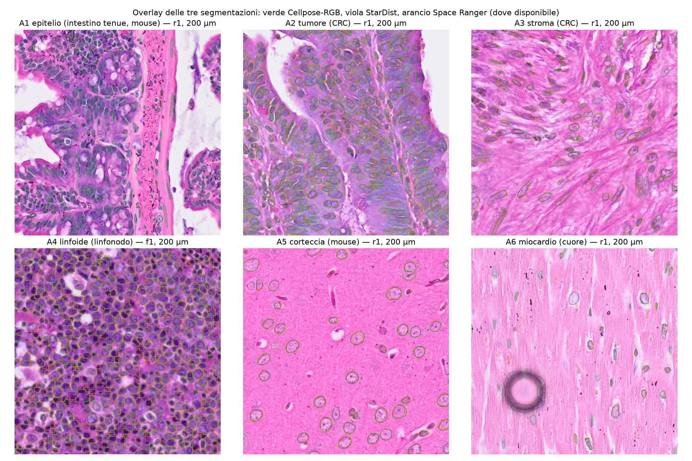

CP-R2.2 (attesa: StarDist↔SR più concordante di Cellpose↔SR, stessa famiglia): vera in A4, A5, A6, falsa in A2 e A3 (dove StarDist perde nuclei che SR trova). La dipendenza di famiglia esiste ma è dominata dalle differenze di soglia/addestramento fra il modello pubblico e quello custom di 10x.

## 4.2 Risoluzione (CP-R2.3, BL-015)

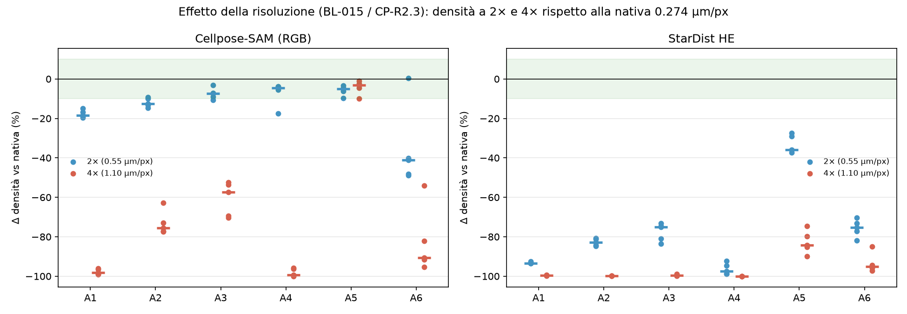

```{r scale}
sc %>% group_by(method, scale, archetype) %>% summarise(dDens_pct = 100*(median(density_rel) - 1), dArea_pct = 100*(median(area_rel) - 1), .groups = "drop") %>%
  pivot_wider(names_from = archetype, values_from = c(dDens_pct, dArea_pct)) %>% kable(digits = 0, caption = "Variazione percentuale di densità e area mediana a 2× (0.55 µm/px) e 4× (1.10 µm/px) rispetto alla nativa")
```

A 2× Cellpose perde il 5–18 % dei nuclei (A3–A5 entro il 10 % ipotizzato; A1, A2 no) e il 41 % in A6; StarDist collassa già a 2× (−36 % in A5, dove i nuclei sono grandi, −75…−98 % altrove: il modello `2D_versatile_he` è addestrato a ~0.25 µm/px e non è stato ridimensionato). A 4× entrambi perdono quasi tutto; una parte di questo effetto per Cellpose è il filtro `min_size = 15 px` (a 1.1 µm/px = 18 µm², sopra la mediana dei nuclei di A1 e A4). **Conclusione per BL-015**: la soglia "≤ 0.5 µm/px" non ha base; con questi modelli serve la risoluzione nativa 0.27 µm/px, e a 0.55 µm/px l'errore è tessuto-dipendente (5–40 %).

## 4.3 Modello nullo: g(r) vs CSR (CP-R2.4)

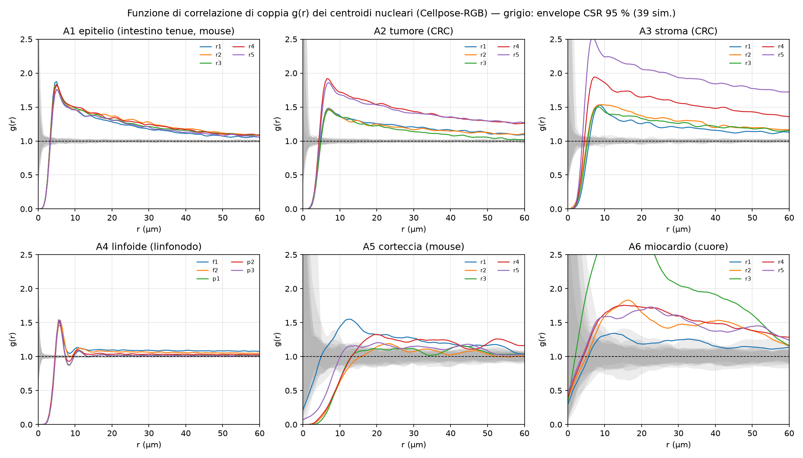

```{r pcf}
sp %>% group_by(archetype) %>% summarise(n_ROI = n(), r_inibizione_um = median(r_inhib_um), g_3um = median(g_at_3um), g_5um = median(g_at_5um), g_10um = median(g_at_10um), g_30um = median(g_at_30um), frac_r_lt5_sotto_envelope = median(frac_r_below_lo_lt5), clark_evans_R = median(clark_evans_R)) %>%
  kable(digits = 2, caption = "g(r) dei centroidi nucleari (Cellpose-RGB), mediane dei ROI: primo r in cui g rientra nell'envelope CSR, g a 3/5/10/30 µm, frazione dei raggi < 5 µm sotto l'envelope, Clark–Evans")
```

Inibizione a corto raggio (g < 1 sotto l'envelope per r < 5 µm) in A2, A3, A4 (r di inibizione 5 µm ≈ diametro nucleare) e in A5 (11.5 µm: neuroni grandi e radi). **Debole** in A1 (r di inibizione 3.5 µm, g(3 µm) = 0.80: nuclei colonnari affiancati con asse minore ~2.5 µm → centroidi a 3 µm sono frequenti) e **assente** in A6 (nessun raggio sotto l'envelope: n piccolo, nuclei in file; e Cellpose qui conta in parte cellule, §4.1). Oltre 10 µm g(r) resta > 1 in A1, A2, A3, A6 (aggregazione a media scala: villi, ghiandole, fasci) e ≈ 1 in A4 (impacchettamento regolare, Clark–Evans 1.5). Per S1.2: la Poisson-disk è giustificata con `d_min` legato all'asse **minore** del nucleo (non al diametro equivalente) e, per A1/A6, una regola anisotropa.

## 4.4 Stroma vs tumore (CP-R2.5, BL-018)

```{r a3a2}
cons %>% filter(archetype %in% c("A2", "A3")) %>% group_by(archetype) %>% summarise(consenso_min = min(density_consensus), consenso_med = median(density_consensus), consenso_max = max(density_consensus)) %>% kable(digits = 0, caption = "A2 (tumore) vs A3 (stroma desmoplastico): intervallo dei 5 ROI")
```

Gli intervalli sono `r ifelse(max(cons$density_consensus[cons$archetype=="A3"]) < min(cons$density_consensus[cons$archetype=="A2"]), "disgiunti", "sovrapposti")`: lo stroma desmoplastico è distinguibile dal tumore per densità (A3 ≈ 0.6 × A2). Resta il dubbio biologico di BL-018 (stroma desmoplastico ≠ stroma lasso): A3 è comunque più denso di quanto la roadmap assumesse per lo stroma lasso.

## 4.5 Tabella delle controprove

```{r checksCP}
f1cs <- mt %>% filter(method_a == "cellpose_rgb", method_b == "stardist_he") %>% group_by(archetype) %>% summarise(f = median(f1_iou05), d = median(abs(delta_density_rel)))
cp_tab <- tribble(~id, ~esito, ~evidenza,
 "CP-R2.1", ifelse(all(f1cs$f >= 0.7), "PASS", ifelse(all(f1cs$f >= 0.5), "WARN", "FAIL")), sprintf("F1 mediano Cellpose↔StarDist per archetipo: %s; |Δ densità| mediano: %s → F1 in fascia WARN in 4/6, densità oltre il 25 %% in 5/6. I due metodi non sono intercambiabili; arbitro in §4.1", paste(sprintf("%s %.2f", f1cs$archetype, f1cs$f), collapse = ", "), paste(sprintf("%s %.0f%%", f1cs$archetype, 100*f1cs$d), collapse = ", ")),
 "CP-R2.2", "WARN", "attesa StarDist↔SR > Cellpose↔SR confermata in A4, A5, A6, smentita in A2, A3",
 "CP-R2.3", "FAIL", "ipotesi '2× < 10 %' vera per Cellpose in A3–A5, falsa in A1, A2, A6 e per StarDist ovunque; '4× > 10 %' confermata (−53…−100 %). BL-015 chiuso con dato empirico: serve la nativa",
 "CP-R2.4", "WARN", "inibizione < 5 µm confermata in A2–A5 (r 5–11.5 µm), debole in A1 (3.5 µm, nuclei affiancati), assente in A6 (n piccolo, segmentazione Cellpose inaffidabile); g → 1 oltre 30 µm solo in A4",
 "CP-R2.5", ifelse(max(cons$density_consensus[cons$archetype=="A3"]) < min(cons$density_consensus[cons$archetype=="A2"]), "PASS", "WARN"), "intervalli A2/A3 disgiunti sui 5 ROI")
cp_tab %>% mutate(esito = verdict(esito)) %>% kable(caption = "Controprove")
```

# Verdetto

- Stato: **chiuso con riserve**.
- Riserve: (1) i valori di BIO_REFERENCES v1 sono stime di consenso fra due segmentatori che disaccordano del 12–55 %, senza conteggio manuale di riferimento → **provvisori** (BL-024); (2) area nucleare A4 sotto la letteratura (B-R2.3): possibile sottostima sistematica dei contorni, da verificare con contorni manuali (BL-025); (3) maschera bolle A6 parziale (BL-026); (4) poligoni Space Ranger quantizzati sulla griglia 2 µm: non usabili come riferimento di area per nuclei piccoli (BL-027); (5) A5_r1 e A4_f1 contengono strisce di tessuto non dell'archetipo; A3 è stroma peritumorale (BL-018 aperto); (6) le attese B-R2.2 e B-R2.4 erano costruite su fonti inadeguate — la discrepanza resta scritta, le attese non sono state modificate.

# Revisione avversariale

Sotto-agente indipendente (2026-09-21, sola lettura sul server, codice proprio): 19 affermazioni ricalcolate → **15 confermate, 3 discrepanze, 1 non verificabile** (`results/R2/R2_adversarial_review.csv`). Ha ricalcolato densità e aree per archetipo dal parquet e dalle maschere (entro 2 %), F1 su tre ROI, riproducibilità bit-identica, scala vs `scalefactors_json`, consenso, quantizzazione SR, effetto scala, C-R2.5 su due ROI, arbitro su A6, e ha ispezionato overlay di A6_r3 e A5_r2.

Discrepanze (tutte **accolte** prima della chiusura):

1. **Bug nella finestra spatstat** (`R2_spatial.R`): `owin(mask = t(m))` produceva la maschera anti-trasposta; il 6.8 % dei nuclei (fino al 30 % in A1_r4) cadeva fuori finestra e non entrava in g(r), Clark–Evans, intensità. Corretto (`owin(mask = m)`, con asserzione che nessun nucleo `keep` cada fuori); statistiche spaziali e figura 5 ricalcolate; le tabelle di §3.2/§4.3 sono quelle corrette.
2. Sintesi §0 contraddiceva la tabella dei check C (3 WARN): riformulata.
3. «StarDist −75…−98 % a 2×» era falso per A5 (−36 %): corretto nel report e in BL-029.

Rilievi non bloccanti accolti: oggetti fantasma nel conteggio degli esclusivi (label azzerate fuori area valida) e soglia OD inerte in A5/A6 (mediana = 0) → `R2_exclusive_check.py` e `R2_metrics.py` corretti, arbitro e consenso ricalcolati; B-R2.6 riportato FAIL come da pre-registrazione; verdetti B riportati anche con il primario Cellpose; Cellpose in A6 riclassificato (segmenta cellule); quantizzazione SR riformulata come unioni di bin; «12–55 %» → «11–55 %». In BACKLOG: BL-032 (esclusivi Cellpose grandi in A5: nuclei o somi?), BL-033 (Cellpose non affidabile in A6; BIO_REFERENCES A6 basata su StarDist/SR/consenso). Non verificato dal revisore: g(r)/dip test non ricalcolati (segnalato il bug, non rieseguita la statistica).

# Riproducibilità

Commit: vedi nota di sessione. Comandi (dalla root del repo, sul server):

```bash
bash tools/setup_python_env.sh                       # .venv (Cellpose) e .venv-stardist (StarDist), lockfile
.venv/bin/python tools/R2_overview.py                # panoramiche H&E + cluster
.venv/bin/python tools/R2_rois.py                    # ritagli 1x1 mm da results/R2/R2_rois.csv
.venv/bin/python tools/R2_segment_cellpose.py --variant rgb --scales 1,2,4 --tag cellpose_rgb
tools/py_stardist.sh tools/R2_segment_stardist.py --scales 1,2,4 --tag stardist_he
.venv/bin/python tools/R2_segment_cellpose.py --variant hed --scales 1 --tag cellpose_hed
.venv/bin/python tools/R2_spaceranger_rois.py && .venv/bin/python tools/R2_metrics.py
.venv/bin/python tools/R2_exclusive_check.py && .venv/bin/python tools/R2_consensus.py
.venv/bin/python tools/R2_export_masks.py && Rscript --vanilla tools/R2_spatial.R
.venv/bin/python tools/R2_figures.py
bash R/testing/test_R2.sh                            # asserzioni C/B/CP: PASS/FAIL
quarto render reports/R2.qmd
```
