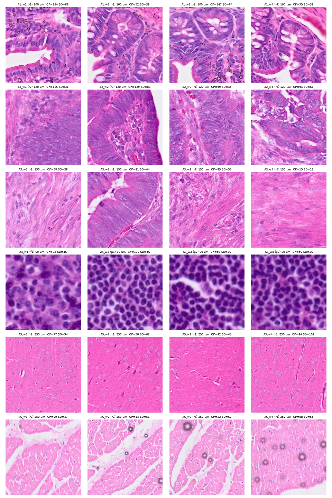
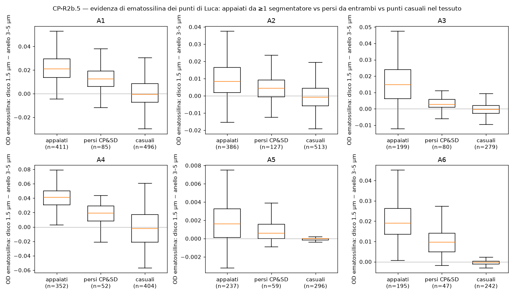
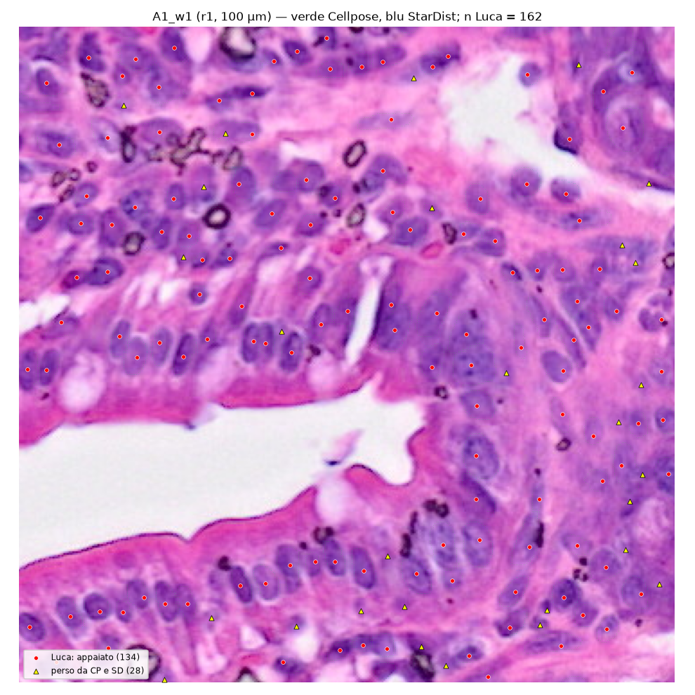
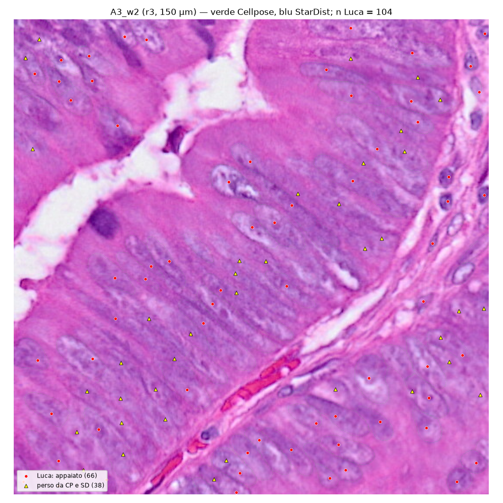
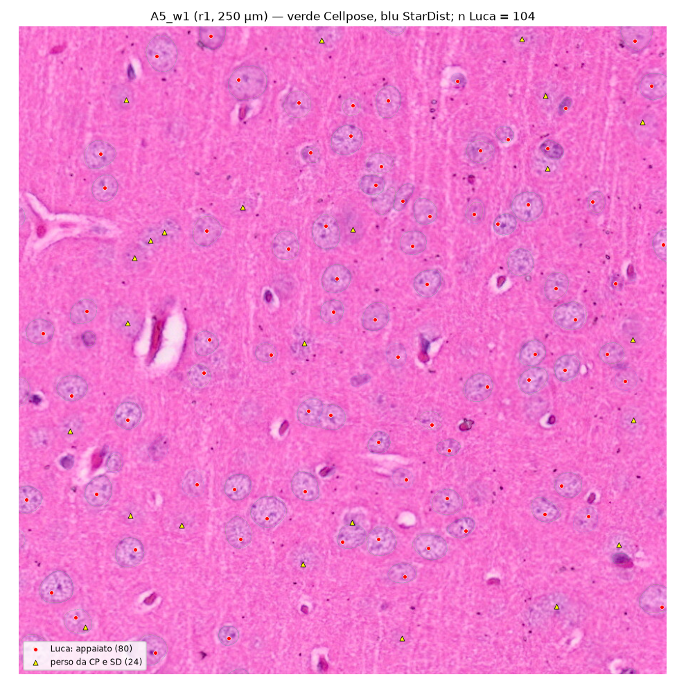
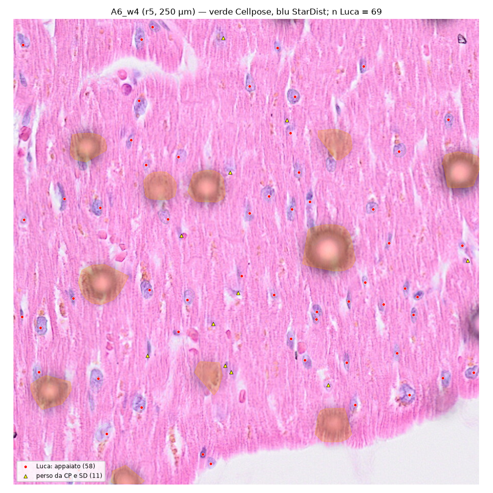

```{r setup}
suppressPackageStartupMessages({library(dplyr); library(tidyr); library(knitr); library(ggplot2)})
R <- "../results/R2b/"
rd <- function(f) read.csv(paste0(R, f), check.names = FALSE, stringsAsFactors = FALSE)
win <- rd("R2b_windows.csv"); man <- rd("R2b_manual_windows.csv"); mat <- rd("R2b_matching.csv"); pts <- rd("R2b_points.csv")
S <- rd("R2b_archetype_summary.csv"); ir <- rd("R2b_interrater.csv"); ns <- rd("R2b_null_summary.csv"); od <- rd("R2b_od_strata.csv"); odF <- rd("R2b_od_strata_Federica.csv")
rvp <- rd("R2b_rater_vs_primary.csv"); tst <- rd("R2b_test_results.csv"); cl <- rd("R2b_checklist_Federica.csv"); cons <- read.csv("../results/R2/R2_consensus_density.csv")
pal <- c(PASS = "#2e7d32", FAIL = "#c62828", WARN = "#ef6c00", `N/A` = "#757575", INFO = "#1565c0")
badge <- function(x) sprintf('<span style="background:%s;color:white;padding:1px 6px;border-radius:3px">%s</span>', pal[x], x)
fmt <- function(x, d = 0) formatC(x, format = "f", digits = d, big.mark = " ")
```

::: {.callout-note}
**Verdetto in una riga.** La densità nucleare manuale (Luca, 2 230 nuclei su 24 finestre; Federica, 1 106 su 12) conferma l'ordinamento R2 ma smentisce il "consenso" R2 come stima puntuale: in A2, A3, A4 e A6 gli umani stanno **sopra entrambi** i segmentatori (B-R2b.1 FAIL), il consenso sbaglia fino al 30 % (B-R2b.2 FAIL) e il 13–29 % dei nuclei umani è perso da Cellpose **e** StarDist (CP-R2b.2 FAIL). La controprova proposta da Luca (CP-R2b.5) mostra che quei nuclei persi sono **più pallidi** (OD ematossilina 18–60 % degli appaiati) ma sopra il fondo: una classe ambigua reale. I due umani concordano sul conteggio (2.3 % sul totale; 6/12 finestre entro il 10 %) ma non sulla posizione (F1 a 3 µm 0.76, soglia 0.90 FAIL). `BIO_REFERENCES` v2 riporta quindi la densità come **intervallo** [nuclei evidenti, nuclei totali] con fonte manuale. I VLM: GPT-6 Astra localizza ma sovraconta (10–47 %); deepseek-flash non è un annotatore. Stato: **chiusa con riserve**.
:::

# 1. Pre-registrazione

Testo integrale, con le aggiunte datate, in `results/R2b/R2b_preregistration.md`. Approvazione di Luca: «procedi» (2026-09-21), poi «La strategia resta 2 umani ma aggiungiamo anche uno o due modelli» (2026-09-21).

**Obiettivo unico.** Verità manuale (punti) su finestre campionate dai 30 ROI R2, per archetipo A1–A6, per (a) fissare le righe di densità di `docs/BIO_REFERENCES.md` (chiudere il "provvisorio", BL-024/BL-030) e (b) misurare recall/precisione di Cellpose-SAM RGB, StarDist HE e Space Ranger 4 per archetipo e scegliere il segmentatore per R3 (BL-032, BL-033).

**Disegno.** Finestre quadrate a lato adattato alla densità (A1 100 µm, A2 120, A3 150, A4 60, A5 250, A6 250; bersaglio 70–110 nuclei), 4 per archetipo su 4 ROI distinti (seed 20260921), tessuto ≥ 90 %, 0 % bolle. Annotazione **alla cieca** con annotatore HTML autonomo. Deviazione dichiarata dalla ROADMAP («100×100 µm»): a 100 µm A5/A6 avrebbero ~10 nuclei per finestra.

**Modifiche di metodo dichiarate prima dei dati** (tutte in pre-registrazione): (1) annotatore v1.1 **solo conteggio** su richiesta di Luca («la complessità introduce errore»): niente contorni, niente giudizio «fuori archetipo» in corso di conteggio; esclusione «illeggibile» solo in A6; (2) il giudizio di omogeneità spostato a una checklist separata per la patologa; (3) area nucleare (B-R2b.5) rinviata a una fase 2 non eseguita; (4) **annotatori automatici** (VLM) aggiunti come rater `model:*` con prompt fissato; (5) **CP-R2b.4** (nullo dei punti casuali) aggiunta dopo l'import del primo VLM, prima dei dati umani; (6) **CP-R2b.5** (stratificazione per evidenza di ematossilina) aggiunta dopo il conteggio di Luca, prima del calcolo, su sua obiezione.

| id | Attesa | Soglia |
|---|---|---|
| C-R2b.1 | finestre dentro ROI/tessuto, coordinate ricostruite | tessuto ≥ 0.90, bolle = 0, round-trip pixel-identico |
| C-R2b.2 | round-trip dell'annotatore | < 0.5 px |
| C-R2b.3 | appaiamento su sintetico | recall/precisione entro 1 % |
| C-R2b.4 | riproducibilità del campionamento | md5 identici |
| B-R2b.1 | manuale fra Cellpose e StarDist (±10 %) | 6/6 |
| B-R2b.2 | consenso R2 vicino al manuale | ±15 % A1–A4, ±20 % A5–A6 |
| B-R2b.3 | direzioni recall (CP>SD A1–A3; SD>CP A5–A6; A4 ≥ 0.85); precisione CP < 0.85 (A5), < 0.70 (A6) | come scritto |
| B-R2b.4 | ordinamento | A4 > A1 > A2 > A3 > A5 > A6 |
| B-R2b.5 | area nucleare manuale | non eseguita (fase 2) |
| CP-R2b.1 | accordo umano Luca–Federica | Δ conteggio < 10 %; F1 (3 µm) > 0.90 |
| CP-R2b.2 | punti umani persi da CP **e** SD | < 5 % |
| CP-R2b.3 | oggetti Cellpose senza punto umano | ≥ 15 % A5, ≥ 30 % A6 |
| CP-R2b.4 | F1 vs nullo punti casuali | > nullo + 0.20 |
| CP-R2b.5 | OD dei persi vs appaiati | ≤ 75 % in ≥ 5/6 |
| VLM-1/2 | GPT-6 Astra errore < 20 %; F1 VLM < 0.6 | come scritto |

# 2. Check C — correttezza software

```{r checkC}
tst %>% filter(section == "C") %>% transmute(id, check, esito = badge(result), dettaglio = detail) %>% kable(escape = FALSE)
```

Le 24 finestre (`R2b_windows.csv`): una per ROI, 4 ROI su 5 per archetipo; tessuto valido 0.92–1.00; ritaglio dal ROI pixel-identico al ritaglio letto dall'immagine intera alle coordinate ricostruite. Il nucleo geometrico dell'annotatore (`tools/R2b_annotator_core.js`) è testato con node (12 asserzioni); l'appaiamento (`tools/R2b_match.py`) con 10 asserzioni su dati sintetici (recall/precisione noti, assegnazione 1:1, esclusioni, area). Comando unico: `bash R/testing/test_R2b.sh`.

{width=100%}

# 3. Check B — plausibilità biologica

## 3.1 Densità nucleare: umani vs segmentatori vs R2

```{r dens}
tb <- function(x) toupper(as.character(x)) %in% c("TRUE", "1", "1.0")
ev <- pts %>% filter(rater == "Luca") %>% mutate(arch = substr(win_id, 1, 2), evident = tb(match_cellpose_rgb) | tb(match_stardist_he) | tb(match_spaceranger)) %>% group_by(arch) %>% summarise(n_evident = sum(evident), .groups = "drop")
areaL <- man %>% filter(rater == "Luca") %>% group_by(archetype) %>% summarise(area = sum(area_net_mm2), .groups = "drop")
common <- ir %>% filter(rater_a %in% c("Luca", "Federica"), rater_b %in% c("Luca", "Federica")) %>% pull(win_id)
dF <- man %>% filter(win_id %in% common, rater %in% c("Luca", "Federica")) %>% group_by(archetype, rater) %>% summarise(d = sum(n_manual) / sum(area_net_mm2), .groups = "drop") %>% pivot_wider(names_from = rater, values_from = d)
tab <- S %>% select(archetype, n_manual, density_manual, ci_lo, ci_hi, density_cellpose_rgb_windows, density_stardist_he_windows, density_spaceranger_windows, consensus_R2_5roi) %>%
  left_join(ev %>% rename(archetype = arch), by = "archetype") %>% left_join(areaL, by = "archetype") %>% mutate(dens_evident = n_evident / area) %>% left_join(dF, by = "archetype")
tab %>% transmute(Archetipo = archetype, `n Luca` = n_manual, `Manuale Luca (IC 95 %)` = sprintf("%s (%s–%s)", fmt(density_manual), fmt(ci_lo), fmt(ci_hi)),
                  `Evidenti (appaiati ≥1 metodo)` = fmt(dens_evident), `Federica (12 fin.)` = fmt(Federica), `Luca (stesse 12)` = fmt(Luca),
                  Cellpose = fmt(density_cellpose_rgb_windows), StarDist = fmt(density_stardist_he_windows), `Space Ranger` = ifelse(is.na(density_spaceranger_windows), "—", fmt(density_spaceranger_windows)),
                  `Consenso R2 (5 ROI)` = fmt(consensus_R2_5roi), `Consenso/Luca` = sprintf("%+.0f %%", 100 * (consensus_R2_5roi / density_manual - 1))) %>%
  kable(caption = "Densità nucleare (nuclei/mm² di tessuto netto) sulle stesse finestre. 'Evidenti' = punti di Luca appaiati da almeno un segmentatore.")
```

```{r densfig, fig.height=5}
long <- tab %>% select(archetype, Luca = density_manual, Federica, Cellpose = density_cellpose_rgb_windows, StarDist = density_stardist_he_windows, `Space Ranger` = density_spaceranger_windows, `Consenso R2` = consensus_R2_5roi, Evidenti = dens_evident) %>%
  pivot_longer(-archetype, names_to = "fonte", values_to = "d") %>% filter(!is.na(d)) %>% mutate(fonte = factor(fonte, c("Luca", "Federica", "Evidenti", "Cellpose", "StarDist", "Space Ranger", "Consenso R2")))
ggplot(long, aes(fonte, d, fill = fonte)) + geom_col() + geom_errorbar(data = tab %>% mutate(fonte = factor("Luca", levels(long$fonte))), aes(x = fonte, ymin = ci_lo, ymax = ci_hi, y = density_manual), width = .3, inherit.aes = FALSE) +
  facet_wrap(~archetype, scales = "free_y") + theme_bw(11) + theme(axis.text.x = element_text(angle = 45, hjust = 1), legend.position = "none", plot.background = element_rect(fill = "white")) +
  labs(x = NULL, y = "nuclei / mm²", title = "Densità nucleare per archetipo: annotatori umani, segmentatori e consenso R2 sulle stesse finestre")
```

### Robustezza del confronto con R2 (rilievi R1–R3 del revisore, accolti)

```{r robust}
rob <- rd("R2b_robustness.csv")
rob %>% transmute(Archetipo = archetype, `Luca / area netta` = fmt(dens_net), `Luca / area tessuto` = fmt(dens_tissue), `IC t 95 % fra le 4 finestre` = sprintf("%s–%s", fmt(pmax(0, t_lo)), fmt(t_hi)),
                  `Consenso R2, 5 ROI` = fmt(cons_5roi), `Consenso R2, 4 ROI campionati` = fmt(cons_sampled), `Δ vs 5 ROI` = sprintf("%+.0f %%", 100 * dev_5roi), `Δ vs ROI campionati (denominatore tessuto)` = sprintf("%+.0f %%", 100 * dev_sampled)) %>%
  kable(caption = "Tre letture alternative dello scarto manuale–consenso R2.")
```

Tre precisazioni dovute al revisore. (R1) L'IC di Poisson tratta i nuclei come indipendenti; la variabilità **fra finestre** è 3–5 volte maggiore (IC t su 4 finestre: A1 7 100–17 700, A4 17 900–38 300): il consenso R2 cade **dentro** l'IC t in 5/6 archetipi e fuori solo in A2 (6 781 < 7 090): con 4 finestre B-R2b.2 ha potenza per bocciare il consenso solo in A2; per gli altri l'evidenza robusta è la direzione sistematica (il consenso sta sotto gli umani in A1, A2, A4 e sopra in A3, A5) e il meccanismo (CP-R2b.5), non il singolo scarto. (R2) Confrontando con i soli 4 ROI campionati: A2 −29 %, A3 +36 %, A4 −15 %, A5 +23 % — B-R2b.2 passerebbe in 2/6, non 3/6. (R3) Il consenso R2 è per mm² di **tessuto**, Luca per mm² di finestra netta (tessuto 0.92–1.00): sull'area tessuto A6 diventa 1 052 /mm² (scarto +6 % anziché +9 %) e A5 1 204.

**A3 senza A3_w2.** La finestra A3_w2 (ROI r3) contiene epitelio ghiandolare tumorale (giudizio di Claude sulla sovrapposizione; la patologa non l'ha valutata, §4.6). Senza di essa: Luca 175 nuclei, **2 593 /mm²** (evidenti 2 060) contro 3 100 con; il consenso R2 (4 016) resta sopra in entrambi i casi. Analogamente **A4_w1 è un follicolo** (18 638 /mm²) contro tre finestre paracorticali (~31 000): il campione R2b ha 1 follicolo su 4 finestre, R2 aveva 2 ROI follicolari su 5 — parte dello scarto A4 (−17 %) è composizione, non segmentazione (rilievo R9).

## 3.2 Recall e precisione dei segmentatori contro gli umani

```{r rp}
rp <- mat %>% filter(rater %in% c("Luca", "Federica")) %>% group_by(archetype, rater, method) %>% summarise(R = sum(tp_points) / sum(n_manual), P = sum(tp) / sum(n_obj), .groups = "drop") %>%
  mutate(v = sprintf("%.2f / %.2f", R, P)) %>% select(-R, -P) %>% pivot_wider(names_from = c(rater, method), values_from = v, names_sep = " · ")
rp %>% kable(caption = "Recall / precisione per archetipo (appaiamento: punto dentro la maschera, altrimenti centroide ≤ 3 µm, 1:1). Federica solo sulle sue 12 finestre.")
```

```{r checkB}
tst %>% filter(section == "B") %>% transmute(id, check, esito = badge(result), dettaglio = detail) %>% kable(escape = FALSE)
```

Lettura. **B-R2b.1 FAIL**: in A2, A3, A4, A6 la densità umana sta sopra sia Cellpose sia StarDist: i due segmentatori sono di parte nello stesso verso, il consenso R2 non è un limite superiore. **B-R2b.2 FAIL**: il consenso R2 differisce dal manuale di −24 % (A2), +30 % (A3), −17 % (A4). **B-R2b.3**: direzione Cellpose > StarDist in A1–A3 confermata (recall 0.82/0.74/0.69 vs 0.41/0.40/0.44); StarDist > Cellpose confermato in A6 (0.71 vs 0.42) ma non in A5 (0.71 vs 0.77); le attese su una **bassa precisione** di Cellpose in A5/A6 (BL-032, BL-033) sono **smentite** (0.89, 0.82, contro un nullo 0.11/0.04, §4.4): Cellpose in A5/A6 perde nuclei, ma quelli che segmenta sono veri. **B-R2b.4 PASS**. Space Ranger è il migliore in A4 (recall 0.94) e A6 (0.89), il peggiore in A3/A5.

# 4. Controprove

## 4.1 CP-R2b.1 — accordo inter-annotatore umano

```{r interrater}
h <- ir %>% filter(rater_a %in% c("Luca", "Federica"), rater_b %in% c("Luca", "Federica")) %>% mutate(n_Luca = ifelse(rater_a == "Luca", n_a, n_b), n_Fed = ifelse(rater_a == "Federica", n_a, n_b))
h %>% transmute(Finestra = win_id, `n Luca` = n_Luca, `n Federica` = n_Fed, `Fed/Luca` = sprintf("%.2f", n_Fed / n_Luca), `Δ rel.` = sprintf("%.0f %%", 100 * rel_diff), `F1 3 µm` = sprintf("%.2f", f1_3um), `F1 5 µm` = sprintf("%.2f", f1_5um)) %>% kable()
ha <- h %>% group_by(archetype) %>% summarise(n_Luca = sum(n_Luca), n_Fed = sum(n_Fed), rel = abs(n_Fed - n_Luca) / ((n_Fed + n_Luca) / 2), f1_3 = 2 * sum(tp_3um) / sum(n_a + n_b), f1_5 = 2 * sum(tp_5um) / sum(n_a + n_b))
tot <- h %>% summarise(rel = abs(sum(n_Fed) - sum(n_Luca)) / ((sum(n_Fed) + sum(n_Luca)) / 2), f1_3 = 2 * sum(tp_3um) / sum(n_a + n_b), f1_5 = 2 * sum(tp_5um) / sum(n_a + n_b))
```

Totale: Luca `r sum(h$n_Luca)`, Federica `r sum(h$n_Fed)` (Δ `r sprintf("%.1f", 100*tot$rel)` %); per archetipo Δ = `r paste(sprintf("%s %.0f %%", ha$archetype, 100*ha$rel), collapse = ", ")`; **`r sum(h$rel_diff < .10)`/12 finestre entro il 10 %**. F1 punto-punto 3 µm `r sprintf("%.2f", tot$f1_3)`, 5 µm `r sprintf("%.2f", tot$f1_5)`. Esito: **conteggio PASS** (soglia < 10 % sul totale e su `r sum(ha$rel < .10)`/6 archetipi; la superano: `r paste(sprintf("%s %.0f %%", ha$archetype[ha$rel >= .10], 100*ha$rel[ha$rel >= .10]), collapse = ", ")`), **posizione FAIL** (0.76 < 0.90). Le differenze di **densità** sulle 12 finestre comuni (§3.1, colonne Federica / Luca) sono invece −12 % in A4 e −12 % in A6: in A6 lo scarto è maggiore di quello dei conteggi perché la densità di Luca è su area netta (esclusioni delle bolle) e quella di Federica su area lorda (non ha disegnato esclusioni pur dichiarando di aver saltato le bolle). Interpretazione: due umani che contano lo stesso numero cliccano punti diversi soprattutto in A2 e A5; la soglia di 3 µm era pensata per l'appaiamento con maschere, non per due click su nuclei di 6–11 µm. Nessuna direzione sistematica fra i due (Federica > Luca in A1, A5; < in A4, A6). Limite di cecità (rilievo R10): l'annotatore non mostrava alcuna segmentazione, ma Luca aveva visto in chat la tavola delle finestre con i conteggi Cellpose/StarDist nei titoli prima di contare; Federica no. Federica ha dichiarato di aver **saltato le bolle** in A6 (coerente con le esclusioni di Luca) e contato **sia neuroni sia glia** in A5. Non avendo disegnato esclusioni, la sua densità A6 è su area lorda: con l'area netta di Luca sulle stesse due finestre passa da 960 a 994 /mm² (Luca 1 085; divario da −12 % a −8 %).

## 4.2 CP-R2b.2 — nuclei umani persi da entrambi i segmentatori

Luca: `r paste(sprintf("%s %.0f %%", S$archetype, 100*S$common_fn_frac_cp_sd), collapse=", ")` — soglia < 5 %: **FAIL 6/6**. Federica (12 finestre): A1 15 %, A2 18 %, A3 14 %, A4 3 %, A5 6 %, A6 16 %. Il consenso R2 (appaiati + esclusivi con evidenza) sottostima strutturalmente in A1–A3, A6.

## 4.3 CP-R2b.5 — i persi sono i pallidi? (tesi di Luca)

{width=100%}

```{r od}
bind_rows(od %>% mutate(rater = "Luca"), odF %>% mutate(rater = "Federica")) %>% transmute(rater, archetype, `n appaiati` = n_matched, `n persi` = n_missed, `OD appaiati` = sprintf("%.3f", od_matched_median), `OD persi` = sprintf("%.3f", od_missed_median), `persi/appaiati` = sprintf("%.2f", ratio_missed_over_matched), `persi sopra Q75 del fondo` = sprintf("%.0f %%", 100 * frac_missed_above_random_q75), esito = badge(ifelse(missed_paler_25pct, "PASS", "FAIL"))) %>% kable(escape = FALSE, caption = "CP-R2b.5: PASS = OD mediano dei persi ≤ 75 % di quello degli appaiati.")
```

**PASS 6/6 per entrambi gli annotatori.** I nuclei umani che i segmentatori perdono hanno un'evidenza di ematossilina pari al 18–60 % (Luca) e 9–63 % (Federica) di quella dei nuclei appaiati: sono la classe ambigua. Ma non sono fondo: in 5/6 archetipi oltre la metà di essi supera il 75° percentile dei punti casuali (in A6 il 94 %). Conseguenza dichiarata: la densità di riferimento è un **intervallo** [evidenti, totale].

## 4.4 CP-R2b.3 e CP-R2b.4 — oggetti fantasma e nullo dei punti casuali

```{r null}
ns %>% filter(rater == "Luca") %>% transmute(archetype, method, `F1 osservato` = sprintf("%.2f", f1_obs), `F1 nullo` = sprintf("%.2f", f1_null), `precisione oss.` = sprintf("%.2f", precision_obs), `precisione nulla` = sprintf("%.2f", precision_null), esito = badge(`CP-R2b.4`)) %>% kable(escape = FALSE, caption = "CP-R2b.4: N punti uniformi nel tessuto valido (N = punti di Luca), 20 repliche, stesse regole di appaiamento.")
```

I click di Luca non sono casuali: F1 0.54–0.90 contro un nullo 0.03–0.55 (PASS 17/17). Il nullo calibra anche la precisione: in A4 un punto casuale cade in un nucleo Cellpose nel 53 % dei casi (area nucleare 34 %), quindi la precisione va letta come guadagno sul nullo. **CP-R2b.3 FAIL**: gli oggetti Cellpose senza punto umano sono l'11 % in A5 e il 18 % in A6, non ≥ 15/30 %: BL-032 e BL-033 vanno riformulati (Cellpose in A5/A6 ha recall basso, non precisione bassa).

## 4.5 Annotatori automatici (VLM)

```{r vlm}
g1 <- rvp %>% filter(grepl("^model:", rater)) %>% group_by(archetype, rater) %>% summarise(ratio = sum(n_rater) / sum(n_primary), mae = median(abs(rel_err)), .groups = "drop")
g2 <- ir %>% filter(xor(rater_a == "Luca", rater_b == "Luca"), grepl("^model:", rater_a) | grepl("^model:", rater_b)) %>% mutate(rater = ifelse(rater_a == "Luca", rater_b, rater_a)) %>% group_by(archetype, rater) %>% summarise(f1_3 = 2 * sum(tp_3um) / sum(n_a + n_b), f1_5 = 2 * sum(tp_5um) / sum(n_a + n_b), .groups = "drop")
g3 <- ns %>% filter(grepl("^model:", rater), method == "cellpose_rgb") %>% select(archetype, rater, f1_gain)
left_join(g1, g2, by = c("archetype", "rater")) %>% left_join(g3, by = c("archetype", "rater")) %>% mutate(rater = sub("model:", "", rater)) %>%
  transmute(archetype, modello = rater, `n/n Luca` = sprintf("%.2f", ratio), `|err| mediano` = sprintf("%.0f %%", 100 * mae), `F1 vs Luca 3 µm` = sprintf("%.2f", f1_3), `5 µm` = sprintf("%.2f", f1_5), `guadagno F1 sul nullo (Cellpose)` = sprintf("%.2f", f1_gain)) %>% kable()
```

GPT-6 Astra (24 finestre, eseguito da Luca con il prompt fissato; versione e data da registrare) sovraconta del 10–47 % (VLM-1 FAIL 4/6) ma localizza (F1 5 µm 0.59–0.92; guadagno sul nullo 0.29–0.53). deepseek-flash (API, `tools/R2b_run_vlm.py`, temperature 0): in modalità thinking sovraconta fino a ×3 e non è ripetibile (due corse sulla stessa immagine differiscono in mediana del 40 %, max ×3.1; tabella `annotations_raw/deepseek_flash_think/repeatability_pairs.csv`); senza thinking produce conteggi ricorrenti (68 in 10 finestre su 24) con posizioni al livello del nullo (guadagno ≈ 0.03). **Nessun VLM è un annotatore utilizzabile per la posizione; nessuno batte i segmentatori dedicati**, salvo GPT-6 Astra in A6 (F1 0.76 vs Cellpose 0.54). Deviazione: la doppia corsa parallela di DeepSeek-thinking su 21 finestre è un errore di procedura, convertito in misura di ripetibilità; il file usato nelle tabelle è la seconda risposta.

## 4.6 Omogeneità delle finestre (checklist della patologa)

Federica ha compilato la checklist (`R2b_checklist_Federica.csv`): 12 finestre giudicate **omogenee** (`r paste(cl$win_id[cl$judgement != "non valutata"], collapse = ", ")`), 12 non valutate, nessun «no». Le 12 valutate non coincidono esattamente con le 12 contate (A2_w3, A4_w3, A5_w3 al posto di w2/w4/w4): probabile sfasamento di riga. **A3_w2 non è stata valutata**: il giudizio «epitelio ghiandolare tumorale» resta di Claude (sovrapposizione in §4.7) e A3 è riportato con e senza (§3.1). Va in BACKLOG.

## 4.7 Sovrapposizioni

Rosso = punto di Luca appaiato ad almeno un segmentatore; triangolo giallo = perso da Cellpose e StarDist; verde = contorni Cellpose; blu = StarDist; arancio = esclusioni di Luca (bolle). Tutte le 24 in `results/R2b/figures/overlay_*.png`.

::: {layout-ncol=2}







:::

# 5. Verdetto

```{r verdict}
tst %>% filter(section %in% c("B", "CP")) %>% transmute(id, check, esito = badge(result), dettaglio = detail) %>% kable(escape = FALSE)
```

**Sessione R2b: chiusa con riserve.** Dopo la revisione avversariale: check C 5 PASS + 1 WARN (maschera bolle), CP-R2b.1a declassato a WARN. Risultati che reggono: ordinamento A4 > A1 > A2 > A3 > A5 > A6 (due umani, tre segmentatori, un VLM); i segmentatori sottostimano la densità umana in A1–A3 e A6 per una classe di nuclei pallidi reale (CP-R2b.5); accordo umano sul conteggio al 2 %. Riserve: (1) il riferimento è un intervallo, non un numero (`BIO_REFERENCES` v2, B-043…B-048); (2) F1 umano–umano 0.76 a 3 µm: la posizione del "centro" di un nucleo non è riproducibile a 3 µm fra umani; (3) A3_w2 fuori archetipo per giudizio di Claude, non della patologa; (4) area nucleare non valutata (BL-025 aperta); (5) A4: Luca–Federica 13 % sul conteggio (A5 al limite, 9.9 %); in A6 le densità differiscono dell'8 % a parità di area netta; (5b) con 4 finestre per archetipo l'IC t è 3–5 volte più largo di quello di Poisson: lo scarto dal consenso R2 è significativo solo in A2 (R1); (6) nessun VLM utilizzabile come annotatore di posizione. Segmentatore per R3: **Cellpose-SAM RGB in A1–A3 e A5; Space Ranger (o StarDist) in A4 e A6**; in ogni archetipo l'estremo superiore dell'intervallo richiede una correzione per i nuclei pallidi (fattore totale/evidenti 1.05–1.34).

# 6. Revisione avversariale

Sotto-agente indipendente (2026-10-07), con accesso ai soli dati grezzi (tabelle per finestra/per punto, JSON delle annotazioni, tavola delle finestre) e a 16 affermazioni numeriche da ricalcolare; non ha visto questo report. Esito: **16/16 affermazioni confermate** alla terza cifra, 2 non verificabili dal bundle (nulli CP-R2b.4 e OD CP-R2b.5, che richiedono immagini e maschere), **3 discrepanze**, **10 rilievi** di metodo. Tabella completa: `results/R2b/R2b_adversarial_review.csv`.

| # | Rilievo | Esito |
|---|---|---|
| D1 | «bolle = 0» in C-R2b.1 è un falso positivo: la maschera bolle R2 (BL-026) non vede le bolle sfocate che Luca ha escluso in A6_w2/w3/w4 | **accolto** → C-R2b.1b WARN; BL-040 |
| D2 | `deepseek_flash_think` A6_w3: 0 punti ma n_manual 242 | **spiegato**: il modello ha restituito `n_nuclei` senza posizioni; per disegno il conteggio dichiarato entra in `manual_windows` (count_only = TRUE) e la finestra è esclusa dall'appaiamento; documentato in `R2b_match.py` |
| D3 | Space Ranger: ±1–2 oggetti in A4_w2/w3/w4, A6_w2 fra `R2b_windows.csv` e `matching` | **accolto come nota**: centroidi da parquet R2 vs da label image rasterizzata (poligoni SR non connessi); < 2 % |
| R1 | IC Poisson sottostima di 3–5× la varianza fra finestre; B-R2b.2 senza potenza | **accolto con precisazione** → §3.1 robustezza; BIO_REFERENCES riporta anche l'IC t. Il revisore scriveva «tutti gli scarti cadono dentro»: in A2 il consenso (6 781) sta sotto l'IC t (7 090–10 758), quindi 5/6, non 6/6 |
| R2 | confronto con i 5 ROI anziché i 4 campionati | **accolto** → §3.1 (2/6 anziché 3/6) |
| R3 | denominatori diversi (finestra netta vs tessuto) | **accolto** → §3.1 |
| R4 | «l'appaiamento non è 1:1» (tp_points > tp) | **respinto con verifica**: 0 oggetti con due punti; i 30 punti in più sono appaiati a oggetti di bordo (centroide fuori finestra entro il margine di 10 µm); la sotto-segmentazione resta visibile come perdita di recall |
| R5 | CP-R2b.1a PASS solo sul totale pooled | **accolto** → WARN (6/12 finestre, 4/6 archetipi) |
| R6 | bias a favore delle maschere grandi; precisione da leggere contro il nullo | **accolto**: già così in §4.4; aggiunta la nota sul diametro implicato (Cellpose A5 11.6 µm vs StarDist 9.5) |
| R7 | scala OD piccola; «più pallidi» non prova che siano nuclei | **accolto in parte**: la scala è quella di `rgb2hed`; il report già dice «classe ambigua, non fondo» |
| R9 | A3_w2 e A4_w1 non rappresentative | **accolto** → §3.1; BL-036 |
| R10 | cecità dell'annotatore primario non totale (tavola con conteggi vista in chat) | **accolto** → §4.1 |
| R11 | identità di Federica assegnata post hoc; VLM-2 GPT-6 al limite (0.59 mediana / 0.61 pooled) | **accolto come nota** (dichiarato nel JSON e nella nota di sessione) |

```{r adv, eval=file.exists(paste0(R, "R2b_adversarial_review.csv"))}
rd("R2b_adversarial_review.csv") %>% select(n, claim, declared, recomputed, result) %>% kable(caption = "Ricalcolo indipendente (estratto; note complete nel CSV).")
```

# Riproducibilità

```
cd ~/2025.geo_spatialtrans
.venv/bin/python tools/R2b_windows.py                # 24 finestre (seed 20260921) + C-R2b.1/4
.venv/bin/python tools/R2b_annotator.py [--rater2]   # annotatore HTML v1.1 (su /mnt/micron/geo_spatialtrans/R2b/)
node R/testing/test_R2b_core.js                      # C-R2b.2
.venv/bin/python tools/R2b_match.py --selftest       # C-R2b.3
.venv/bin/python tools/R2b_import_model.py --model gpt6_astra results/R2b/annotations_raw/gpt6_astra/nuclei_results.json
.venv/bin/python tools/R2b_run_vlm.py --base-url https://api.deepseek.com --model deepseek-flash --key-env DEEPSEEK --images <png> --prompt results/R2b/R2b_model_prompt.md --out <dir> --thinking enabled|disabled
.venv/bin/python tools/R2b_match.py --primary Luca   # appaiamento, inter-rater, sommario
.venv/bin/python tools/R2b_null_and_figures.py       # CP-R2b.4 + sovrapposizioni
.venv/bin/python tools/R2b_od_strata.py [--primary Federica]   # CP-R2b.5
bash R/testing/test_R2b.sh                           # PASS/FAIL
quarto render reports/R2b.qmd
```
