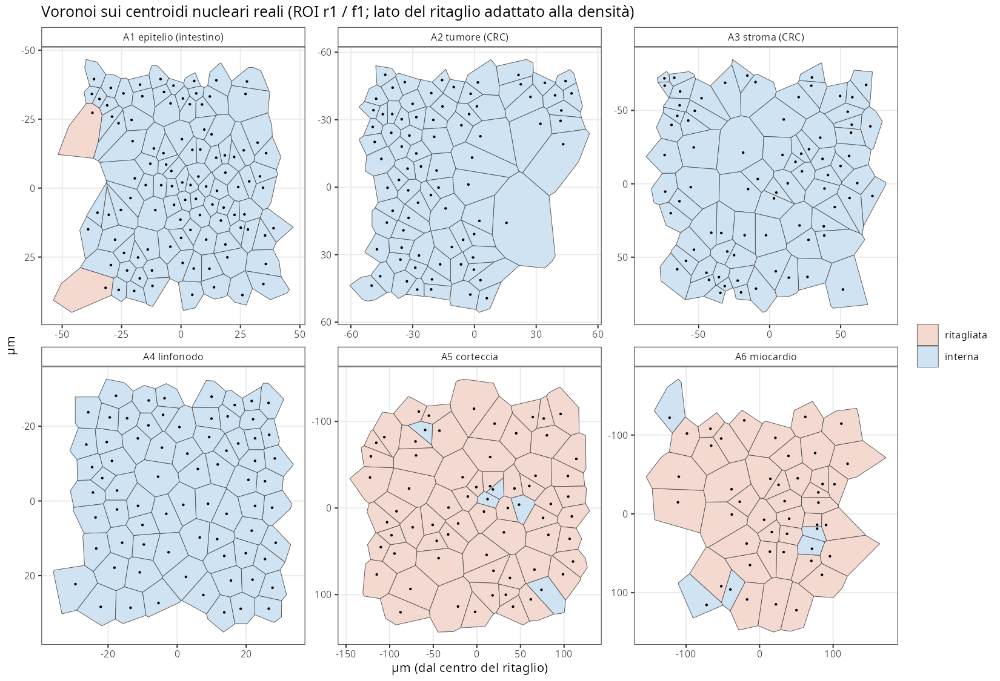
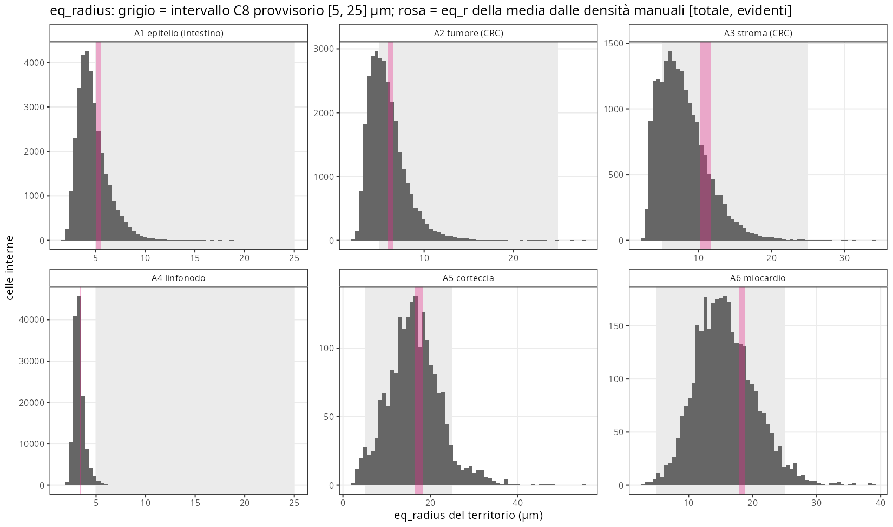
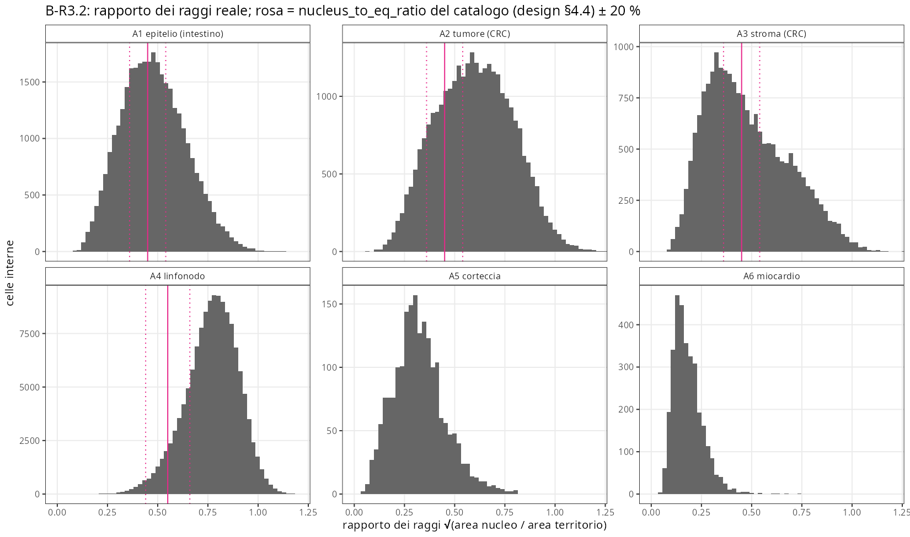
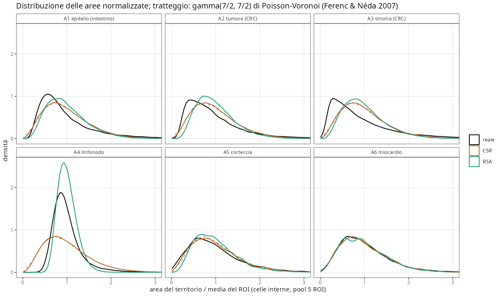
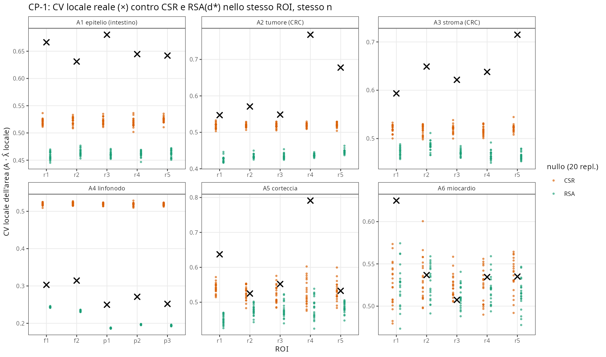
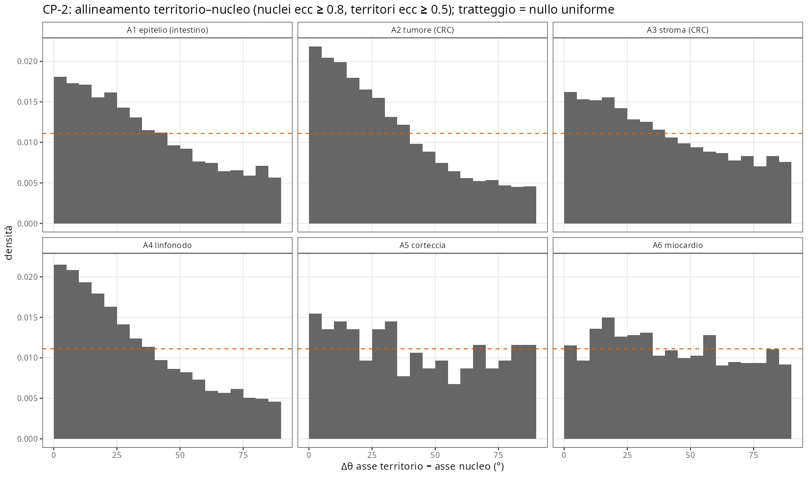
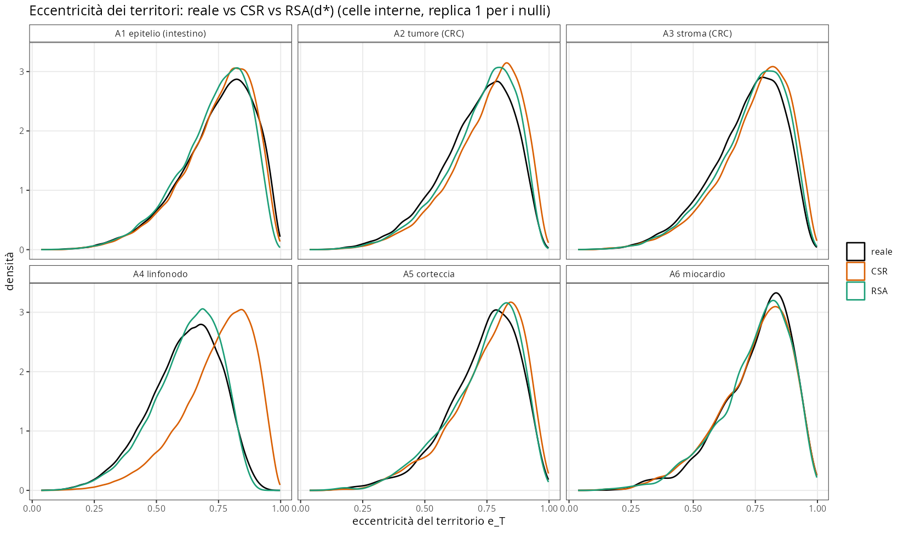
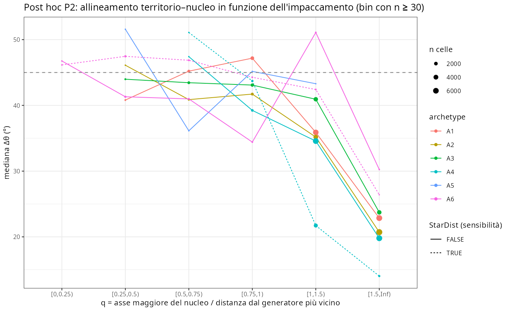
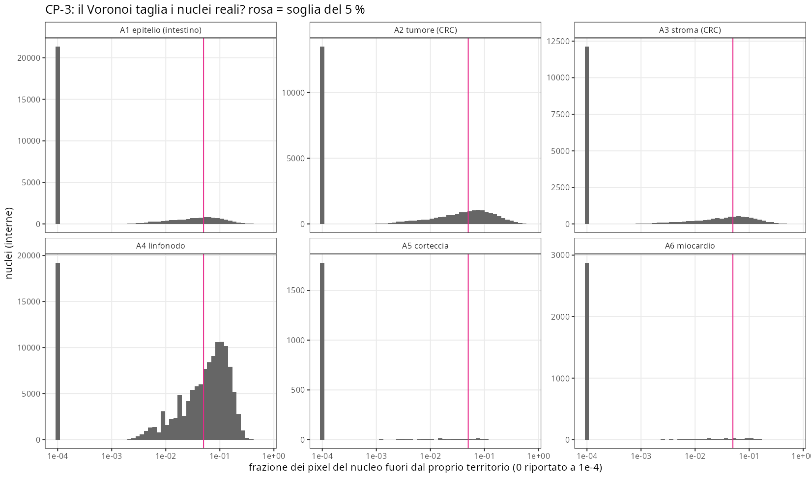
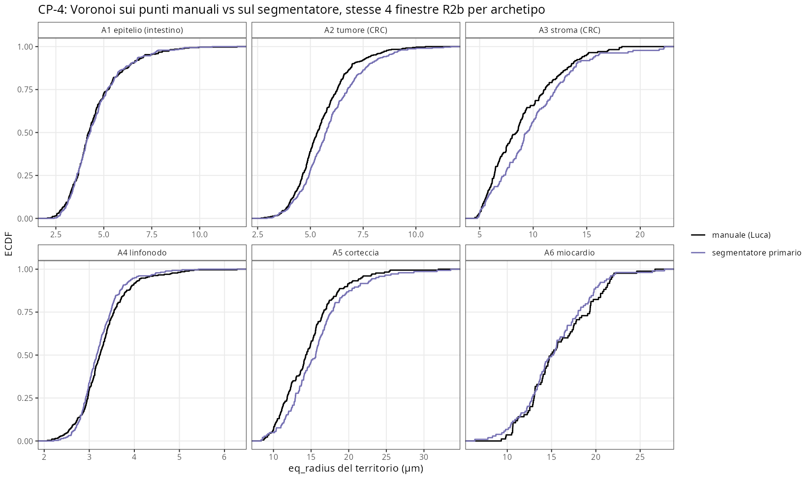

```{r setup}
.libPaths("~/2025.geo_spatialtrans/renv/library/linux-ubuntu-noble/R-4.6/x86_64-pc-linux-gnu")
RES <- "../results/R3"; FIG <- file.path(RES, "figures")
rd <- function(f) read.csv(file.path(RES, f), check.names = FALSE)
k <- function(d, digits = 3) knitr::kable(d, digits = digits, row.names = FALSE)
V <- rd("R3_verdicts.csv"); CS <- rd("R3_cells_summary.csv"); RR <- rd("R3_roi_summary.csv")
```

**Obiettivo unico.** Tassellazione di Voronoi dei centroidi nucleari reali dei 30 ROI R2 (5 per archetipo A1–A6), ritagliata sulla maschera valida (tessuto − bolle): distribuzioni empiriche per archetipo di area ed eq_radius del territorio, N/C, eccentricità e orientazione del territorio, contenimento dei nuclei; quanto il Voronoi «puro» spiega la geometria reale. Riferimento per i check B di S1.3–S1.4.

**Sintesi.**

- **Software (C):** 28/28 check sintetici, 11/11 sui dati reali, 5/5 mutanti, riproducibilità bit per bit (1 408 file). C-R3.8 ha trovato un difetto di precisione nei momenti nucleari, corretto prima di qualsiasi analisi.
- **Biologia (B):** 8 previsioni confermate su 14 con verdetto (17/30 sull'intero report). Le smentite principali:
  - in A1 l'eq_radius mediano è 4.42 µm, sotto l'intervallo C8 [5, 25];
  - il rapporto dei raggi supera le previsioni in tutti gli archetipi;
  - la regola «nucleo ∝ territorio» è sostenuta in 3/6 archetipi (previsto ≤ 2).
- **Controprove:**
  - il Voronoi di un processo omogeneo non riproduce la variabilità delle aree in A1–A3; RSA(d*) è troppo regolare in A4;
  - in **A6 i territori di Voronoi dei nuclei non hanno alcuna anisotropia**: né più allungati di RSA, né allineati ai nuclei (0/5 ROI). L'anisotropia del miocardio non passa per il pattern dei nuclei;
  - l'allineamento territorio–nucleo esiste nei tessuti densi (A1, A2, A4), cresce con l'impaccamento ed è compatibile con il volume escluso dei nuclei (post hoc).
- **Verdetto:** chiuso con riserve.

# 1. Pre-registrazione

Testo integrale: `results/R3/R3_preregistration.md`, commit `3fac4e7`, approvato da Luca il 2026-10-08 («approvo») prima di qualsiasi codice. L'approvazione copre le decisioni D-R3.1–D-R3.3:

- segmentatore di R2b; sensibilità StarDist in A4/A6;
- BL-035 come calibrazione sulle finestre R2b;
- R3 prima di S1.3.

Gli script di metrica, run e analisi sono stati committati **prima** del run sui dati reali (`bc1d1c0`, BL-059). Le soglie non sono state modificate.

**Deviazioni e precisazioni dichiarate** (tutte rilevate o confermate dalla revisione avversariale, `results/R3/R3_review_actions.csv`):

| # | Testo pre-registrato | Implementato | Effetto |
|---|---|---|---|
| 1 | C-R3.4: «media area normalizzata 1 ± 0.01» | area × λ (normalizzare per la media del campione renderebbe il check tautologico) | più severo |
| 2 | C-R3.3c: «momenti del poligono vs regionprops» | momenti dei **pixel** vs regionprops. La coerenza poligono↔pixel è indiretta: entrambi coincidono con l'angolo analitico (C-R3.3b, C-R3.3c) | nessuno sui verdetti |
| 3 | M5 «varianza al posto della deviazione standard» | rapporto delle deviazioni standard al posto delle varianze (l'inverso) | mutante rilevato comunque |
| 4 | CP-4: regione = quadrato ∩ maschera | anche meno le esclusioni di Luca (A6_w2–w4): stessa area per manuale e segmentatore | coerente con R2b |
| 5 | maschere «913×913» | A5 912×912; il codice usa `ncol`, nessun effetto | refuso |
| 6 | — | intensità locale con `leaveoneout = FALSE`; permutazioni con seed per ROI; CV per ROI = sd/media delle interne | specificazioni, non divergenze |

**Difetto trovato e corretto durante il run.** C-R3.8 (eccentricità ricalcolata dai pixel contro il parquet di R2) ha dato FAIL: 8.7e-5 sui nuclei quadrati di Space Ranger, con eccentricità esatta 0. La causa era la cancellazione in E[x²] − c² con coordinate fino a 1 000 µm. Correzione: momenti centrati in due passate (`508a74a`). Dopo la correzione lo scarto è 2.6e-7 (PASS). Nessun verdetto era stato calcolato prima della correzione.

# 2. Check C — correttezza software

```{r checkC}
cs <- rbind(cbind(set = "sintetico", rd("R3_test_synthetic.csv")), cbind(set = "reale", rd("R3_test_real.csv")),
            cbind(set = "riproducibilità", rd("R3_test_repro.csv")))
k(cs[, c("set", "check", "case", "value", "result", "note")], 6)
k(rd("R3_mutants.csv"))
```

Ogni mutante è stato rilevato dal check costruito per lui:

- M1 (tile permutati) → C-R3.2;
- M2 (niente ritaglio) → C-R3.1;
- M3 (x↔y nel contenimento) → C-R3.5;
- M4 (flag interne ignorato) → C-R3.3a;
- M5 (eccentricità) → C-R3.3b.

Il riferimento esterno di C-R3.4 (CSR, varianza dell'area normalizzata 0.289 contro 2/7 = 0.286) è la forma gamma con a = b = 7/2 di Ferenc & Néda 2007 (doi:10.1016/j.physa.2007.07.063).

# 3. Check B — plausibilità biologica (A1–A6)



```{r arch}
k(CS[, c("archetype", "method", "n_interior", "area_median", "area_q25", "area_q75", "eq_r_median", "nc_median",
         "ratio_median", "ecc_T_median", "spearman_nuc_terr", "frac_cut")])
```

```{r verdB}
k(V[grepl("^B", V$id), c("id", "archetype", "statistic", "value", "threshold", "assertion", "predicted", "prediction_confirmed", "note")], 4)
```





**Lettura.**

- **B-R3.1.** A4 FAIL, come previsto: 3.20 µm con Space Ranger, 3.64 con StarDist. A1 FAIL contro la previsione: 4.42 µm.
  - La previsione confrontava l'eq_r della **media** (5.06–5.56 µm dalle densità manuali) con un'asserzione sulla **mediana** di una distribuzione asimmetrica (CV 0.72).
  - Anche includendo i territori ritagliati la mediana resta 4.63 µm, e 4.645 lontano dal bordo del ROI (revisore claims).
  - Ne segue che l'intervallo C8 [5, 25] µm è inadeguato in due archetipi su sei, non in uno (BL-006).
- **B-R3.2.** Tutte e quattro le previsioni sono smentite: il rapporto dei raggi mediano per cellula è più alto di quello previsto in ogni archetipo (A1 0.47, A2 0.60, A3 0.44, A4 0.78).
  - La previsione usava √(A_nuc mediana · ρ), cioè un altro stimatore (BL-065).
  - In A4 il verdetto dipende dal segmentatore: con StarDist il rapporto è 0.62 (entro 0.55 ± 20 %), con Space Ranger 0.78 (BL-060).
- **B-R3.3.**
  - A4 N/C 0.61 con SR, 0.38 con StarDist: l'ipotesi della roadmap «N/C 0.8–0.9» è smentita con entrambi.
  - A3 ha N/C più basso di A1 e A2 (0.20 < 0.22 < 0.36).
  - A5: aree dei territori unimodali in 5/5 ROI (dip p 0.93–0.995).
- **B-R3.4.** La regola «nucleo ∝ territorio» è sostenuta (Spearman ≥ 0.3) in A2, A4, A5 (3/6, previsti ≤ 2). Per ROI e a maggioranza sarebbe 2/6 (A5 2/5). Parte della correlazione può essere meccanica: un nucleo grande allontana i vicini.

**Effetto della selezione delle celle interne** (post hoc P3; revisore claims RA-10/21):

- la frazione di interne è 0.44 in A5 e 0.65 in A6, contro 0.85–0.98 negli altri archetipi;
- le interne di A1 hanno area media pari a 0.82 × quella di tutti i territori;
- i buchi sono nella **maschera di tessuto** (fino a 221 per ROI in A5), non nella maschera bolle: P4, con il ritaglio solo sul tessuto, non cambia A1–A5;
- **conseguenza per S1.3:** i check B devono applicare al simulato la stessa maschera e la stessa regola d'interna (BL-061). Le funzioni sono in `tools/R3_voronoi_metrics.R`.

```{r p3}
k(rd("R3_posthoc_P3_interior_bias.csv"))
```

# 4. Controprova

## CP-1 — il Voronoi di un processo omogeneo spiega la variabilità delle aree?





```{r cp1}
k(rd("R3_cp1_roi.csv")[, c("archetype", "roi_id", "cv_loc_real", "cv_loc_csr_min", "cv_loc_csr_max", "cv_loc_rsa_median", "pos_cvloc_csr", "rel_err_rsa_cvloc")])
```

- **A1–A3:** CV locale reale sopra CSR in 15/15 ROI. Nessun processo omogeneo riproduce la dispersione delle aree, nemmeno su una banda di 5 spaziature (BL-051 confermato).
- **A4:** reale più regolare di CSR (5/5), come previsto, ma **meno** regolare di RSA(d*) (0/5 entro ±10 %). Il 22–28 % delle distanze al primo vicino dei centroidi SR è < d* = 4 µm (revisore claims): d* è mal specificato su questi centroidi (BL-050).
- **A5:** CV locale dentro o sopra CSR (0/5 sotto). L'inibizione a corto raggio vista in g(r) (S1.2) non si traduce in aree più regolari: domina l'eterogeneità a scala > 5 spaziature (strati e vasi).
- **A6:** praticamente CSR (1/5 sopra); RSA(d*) entro ±10 % in 4/5.

## CP-2 — A6, controllo negativo: anisotropia dei territori





```{r cp2}
k(rd("R3_cp2_roi.csv")[, c("archetype", "roi_id", "n_eligible", "median_dtheta", "perm_p", "ecc_T_real", "ecc_T_rsa_median", "d_ecc_rsa")])
k(rd("R3_posthoc_P1_stardist.csv"))
```

- **A6: entrambe le previsioni smentite**, con Space Ranger e con StarDist. Δθ mediano 37–46° (nullo 45°), permutazione p ≥ 0.02; e_T reale − RSA da +0.003 a +0.024 (soglia 0.05).
  - Interpretazione: i territori di Voronoi dei nuclei del miocardio sono geometricamente indistinguibili da quelli di un processo isotropo.
  - Il fallimento previsto di S1.3 su A6 non va quindi misurato contro il «Voronoi reale», che è anch'esso isotropo, ma contro una misura indipendente della forma cellulare, che R3 non fornisce (BL-064).
- **A4 (CP-2c):** e_T reale ≈ RSA in 5/5 ROI, come previsto.
- **Allineamento nei tessuti densi.** Mediana Δθ 24–32° con p < 1/2001 in A1 (5/5), A2 (5/5), A4 (5/5) e in A3 (3/5); assente in A5.
  - Non è un artefatto di convenzione né dei centroidi SR: il revisore code l'ha verificato con il jitter ±1 µm e con StarDist (19.6–27.0°).
  - Il PASS di A1 non va letto come «palizzata epiteliale».



**Post hoc P2 (non pre-registrato).** Δθ scende da ~45° a 20–25° quando l'asse maggiore del nucleo supera 1.5 volte la distanza dal vicino più prossimo, in tutti gli archetipi in cui questo regime esiste. A6 ha q mediano 0.53–0.59 e non entra nel regime.

L'ipotesi del volume escluso (nuclei che non si sovrappongono allontanano i vicini lungo il proprio asse maggiore) è **compatibile con i dati, non dimostrata**:

- q dipende in parte dalla direzione del vicino;
- l'alternativa dell'ordine nematico locale (Δθ fra nuclei vicini 10–17°) non è esclusa;
- serve un nullo con ellissi rigide a orientazione casuale (BL-063).

## CP-3 — il Voronoi taglia i nuclei reali?



- **Esiti:**
  - A1 15.2 % (previsto ≥ 10 %: PASS); A5 2.5 % (previsto ≤ 5 %: PASS);
  - registrati: A2 27.5 %, A3 17.7 %, A4 53.0 % (SR) / 1.1 % (StarDist), A6 4.1 % (SR) / 1.0 % (StarDist).
- **Revisione avversariale:** CP-3 misura soprattutto la **convenzione di bordo del segmentatore**.
  - A1 scende a 6.3 % erodendo le maschere di un pixel (0.27 µm).
  - In A4 il 93–97 % dei nuclei SR tocca un'altra maschera (bin 2 µm contigui).
  - Il PASS di A1 è quindi fragile; un riferimento richiede contorni manuali (BL-039, BL-062).

## CP-4 — calibrazione BL-035 (finestre R2b)



```{r cp4}
k(rd("R3_cp4.csv"))
```

- **Previsione smentita:** CV_seg > CV_manuale in 4/6 archetipi; A1 e A4 vanno al contrario. L'IC 95 % bootstrap di ΔCV contiene 0 in 6/6 archetipi (revisore claims): con 4 finestre CP-4 non ha potenza (BL-041).
- **Fattore di correzione** di eq_r (segmentatore / manuale): 0.98–1.11, coerente con √(n_manuale/n_seg). Su questo fattore si costruisce l'intervallo [corretto, segmentatore] dei riferimenti.

## Descrittivi

```{r desc}
k(rd("R3_descriptive.csv"))
k(rd("R3_sensitivity.csv"))
```

- **D-1:** l'oggetto hed contiene il generatore nell'81–97 % dei casi in A1–A4, solo nel 50–68 % in A5–A6; la sua area è 3–78 % del territorio. Come stima del territorio cellulare non è utilizzabile (BL-028).
- **D-2:** Clark–Evans nella forma standard (correzione cdf) va da 1.00 (A1, A6) a 1.50 (A4) e sostituisce le «Clark–Evans» di R2 (BL-054).
- **D-3:** varianza del numero di lati reale contro CSR: 0.86 contro 1.78 in A4, uguale a RSA (0.85); 1.34–1.69 negli altri.

# Verdetto

**Chiuso con riserve.**

- **Riferimenti:** `docs/BIO_REFERENCES.md` B-055…B-090 (6 metriche × 6 archetipi, intervallo [corretto, segmentatore]; sono riferimenti da applicare **con la stessa maschera e la stessa regola d'interna**, BL-061).
- **Riserve:**
  - BL-060: Space Ranger in A4/A6 (orientazione agganciata agli assi, N/C, contenimento) → decisione di Luca;
  - BL-061: selezione delle interne;
  - BL-062: CP-3 dipende dal segmentatore;
  - BL-063: meccanismo dell'allineamento;
  - BL-064: A6 senza riferimento di forma cellulare;
  - BL-065: previsioni con lo stimatore sbagliato;
  - BL-066: intervalli C8 per archetipo;
  - BL-067: convenzione dei bordi;
  - BL-068: eterogeneità delle aree.

# Revisione avversariale

Due sotto-agenti indipendenti hanno lavorato il 2026-10-08 sui dati grezzi e sugli script, senza commit, con le uscite in `results/R3/review/`.

- **code** ha usato un'implementazione Python indipendente (shapely `voronoi_polygons`, momenti per triangoli, punto-in-poligono, CV_loc via FFT) e ha ricalcolato su 40/40 ROI × metodo:
  - n, conservazione, frazione di interne, aree, eq_r, CV, e_T, N/C, nuclei tagliati, Δθ: tutto coincide a precisione di macchina;
  - unica eccezione: 1 nucleo esattamente su un bordo di pixel in A6 r3, e i pareggi del contenimento con centroidi SR;
  - nessun bug trovato; 20 rilievi.
- **claims** ha ricalcolato tutti i 55 verdetti dal testo pre-registrato (55/55 identici) e ha controllato le regole di decisione e i nulli. 24 rilievi, fra cui:
  - premessa di P4 sbagliata (bug di analisi post hoc, accolto);
  - selezione delle interne non neutra;
  - d* mal specificato in A4;
  - CP-3 dominato dalla convenzione di bordo;
  - CP-4 senza potenza;
  - deviazioni di formulazione 1–4 sopra.

Azioni rilievo per rilievo: `results/R3/R3_review_actions.csv`.

```{r review}
k(rd("R3_review_actions.csv"))
```

# Riproducibilità

Commit: vedi `docs/sessions/2026-10-08_R3.md`.

```bash
bash R/testing/run_R3.sh       # synthetic mutants real null calib analysis figures repro (~50 min su 40 core)
Rscript --vanilla tools/R3_posthoc.R; .venv/bin/python tools/R3_export_tissue.py; Rscript --vanilla tools/R3_posthoc_P4.R
quarto render reports/R3.qmd
```

Per cellula su `/mnt/micron/geo_spatialtrans/R3/`; md5 degli ingressi in `results/R3/R3_inputs_md5.txt`.
