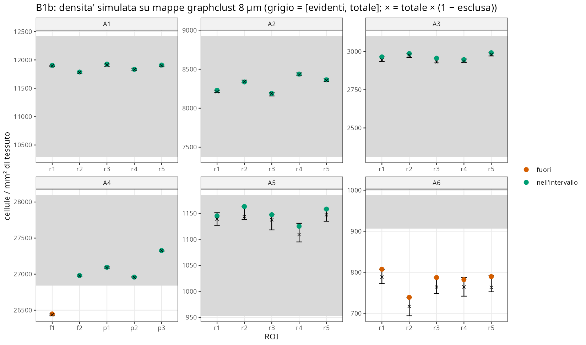
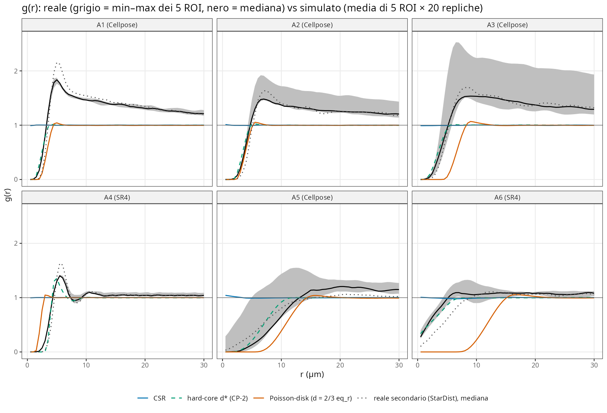
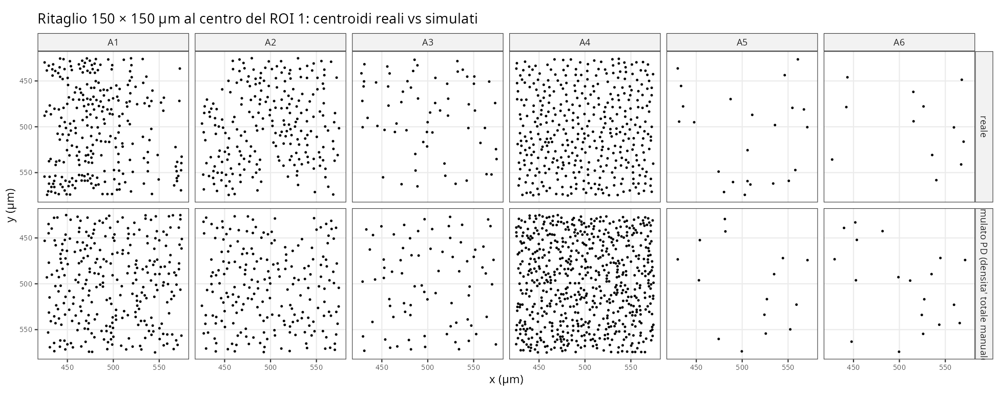
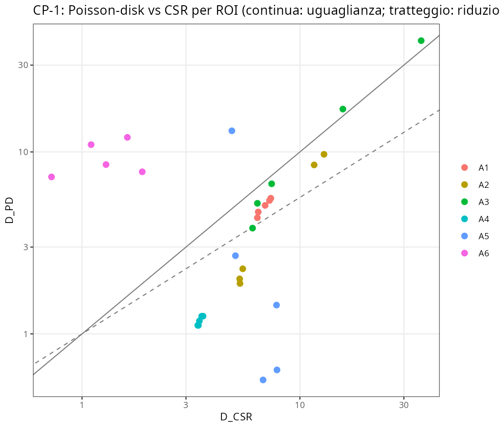
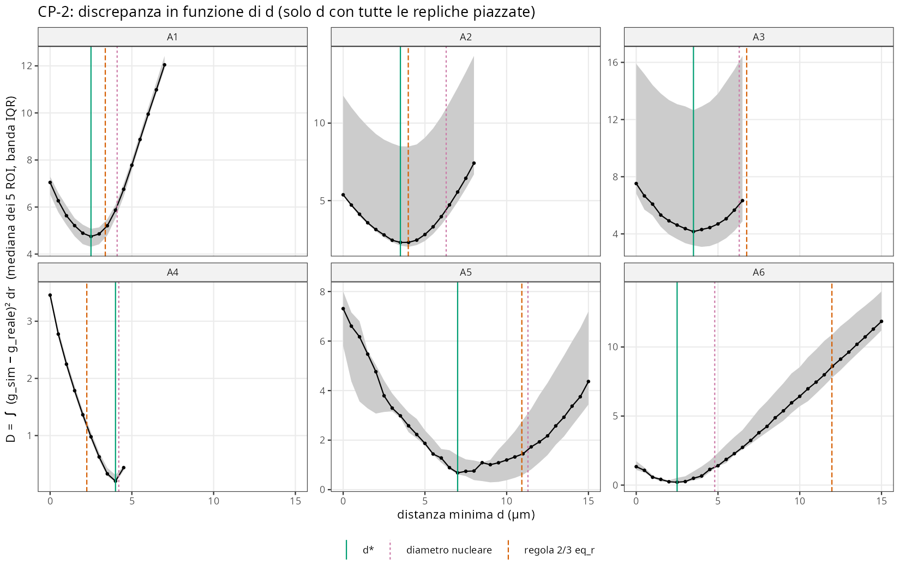
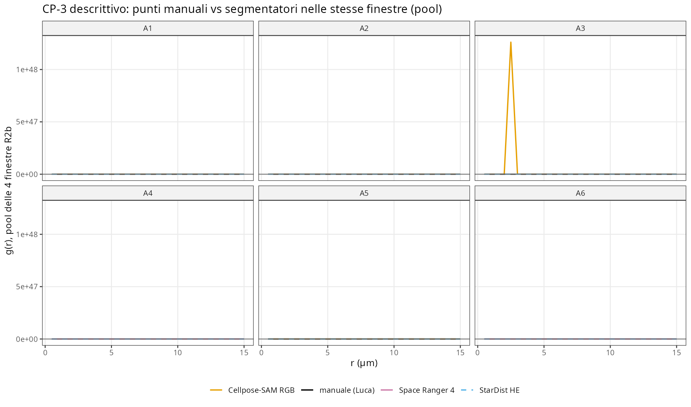

```{r setup}
#| include: false
.libPaths("~/2025.geo_spatialtrans/renv/library/linux-ubuntu-noble/R-4.6/x86_64-pc-linux-gnu")
suppressPackageStartupMessages({ library(knitr) })
RES <- "../results/S1.2"
rd  <- function(f) read.csv(file.path(RES, f), stringsAsFactors = FALSE)
tr  <- rd("S1.2_test_results.csv"); mu <- rd("S1.2_mutants.csv"); pf <- rd("S1.2_perf.csv")
S   <- rd("S1.2_checkB_summary.csv"); cp1 <- rd("S1.2_CP1.csv"); cp2 <- rd("S1.2_CP2.csv"); cp3 <- rd("S1.2_CP3.csv")
b1a <- rd("S1.2_B1a.csv"); b1b <- rd("S1.2_B1b.csv"); b2 <- rd("S1.2_B2.csv"); AR <- rd("S1.2_archetype_params.csv")
sens <- rd("S1.2_CP_sensitivity_r05.csv"); fx <- rd("S1.2_fixcheck.csv"); act <- rd("S1.2_review_actions.csv")
mk  <- rd("S1.2_manual_K.csv"); cu <- rd("S1.2_pcf_curves.csv")
pr <- cu[cu$source == "reale primario" & cu$r > 0, ]
envw <- sapply(split(pr, pr$archetype), function(d) median(tapply(d$g, d$r, function(g) diff(range(g)))))
f1 <- function(x, d = 1) formatC(x, format = "f", digits = d, big.mark = " ")
```

**Sessione**: S1.2 · 2026-10-08 · branch `step1-cell-layer` · pre-registrazione `60187fb` · stato pre-revisione `6316790` · chiusura: commit successivo (sha nella nota di sessione).
**Obiettivo unico**: `seed_centroids(regions, cell_types, region_composition, random_seed)` in `R/04b2_seed_centroids.R`.
Fuori scope: Voronoi (S1.3), nuclei e nuclei pallidi (S1.4, BL-035), preset e orchestratore (S1.5), implementazione di BL-042/BL-043.

**In breve.** Dopo le correzioni della revisione avversariale la funzione fa ciò che dichiara: check C `r sum(tr$status=="PASS")`/`r nrow(tr)` PASS, `r sum(mu$status=="PASS")`/`r nrow(mu)` mutanti rilevati, 450 000 punti in `r f1(pf$elapsed_s)` s. Sul piano biologico il Poisson-disk con la regola del design (d = ⅔·eq_radius) è giustificato **al limite**: secondo la definizione pre-registrata batte la CSR in 4 archetipi su 6 (soglia 4, previsti 5); con 3 delle 4 varianti di sensibilità scende a 3/6. La regola stessa è adeguata solo in A1 e A2. In 5 archetipi su 6 la distanza minima preferita dai dati (d\*) è più piccola della regola; in modo descrittivo segue meglio la taglia del nucleo che la densità. In tutti gli archetipi resta un'aggregazione (g(r) > 1 fra 5 e 30 µm) che nessun processo hard-core omogeneo produce.

# 1. Pre-registrazione

Testo integrale: `results/S1.2/S1.2_preregistration.md`, committato **prima** del codice (`60187fb`). Approvazione di Luca in chat il 2026-10-08 («approvo»), dopo tre decisioni prese in apertura:

| Decisione | Contenuto | Chi |
|---|---|---|
| BL-042 | stride dai metadati di generatori/loader; stride stimato > 1 non dichiarato → errore (implementazione in S1.1b/S1.5) | Luca |
| BL-043 | componenti sotto soglia assegnate alla regione adiacente con il confine condiviso più lungo; escluse solo se isolate (implementazione in S1.1b/S1.5) | Claude su delega di Luca |
| D3 | densità di una regione mista = media **armonica** 1/Σ(f_i/ρ_i) (frazioni per numero di cellule) | Luca |

Deviazioni dal design §5.2 approvate: (1) RSA a n fissato invece di Bridson — Bridson è massimale e con d = ⅔·eq_radius satura a ≈ 5× la densità target; a n target il riempimento è η = 1/9 per ogni densità, lontano dal limite RSA 0.547 (Feder 1980, doi:10.1016/0022-5193(80)90358-6); (2) arrotondamento stocastico non distorto (Bernoulli per regione, Madow per tipo); (3) distanza minima globale con d_ij = (d_i+d_j)/2; (4) `min_dist_um` opzionale; (5) preset rinviati a S1.5; (6) `n_failed` registrato invece del ciclo infinito.

Parametri per archetipo (densità totale manuale B-043…B-048, intervallo [evidenti, totale]):

```{r}
x <- AR[, c("archetype", "tot", "evid", "eq_r", "d_rule", "d_nuc", "primary")]
x$eq_r <- round(x$eq_r, 2); x$d_rule <- round(x$d_rule, 2)
names(x) <- c("arch.", "totale /mm²", "evidenti /mm²", "eq_radius (µm)", "d regola ⅔·eq_r (µm)", "d nucleare (µm, provv.)", "segmentatore primario")
kable(x)
```

**Definizioni operative aggiunte dopo l'approvazione e prima del run** (nelle intestazioni di `R/testing/test_S1.2.R` e `tools/S1.2_checkB.R`; specificano input e stimatori senza cambiare soglie):
catalogo di test non biologico (T1–T4) e composizioni dei sintetici; C4c valutato su I1–I4; finestra = maschera di tessuto R2; banda della `pcf` **fissata per ROI** a quella di Stoyan del pattern reale primario (altrimenti la densità diversa fra reale e simulato cambierebbe il lisciamento); D integrato su r = 0.5…30 µm (g(0) non stimabile); griglia CP-2 con `max_attempts_factor = 50` e arresto alla prima replica non piazzata; B1a con tolleranza ±1 cellula/area. **Due di queste erano sbagliate.** La tolleranza di B1a è discussa in §3.1. La seconda: la versione pre-revisione integrava D da r = 0.5 «perché g(0) non è stimabile». Era una deviazione non necessaria dalla pre-registrazione (∫₀³⁰), perché g(0) è finito per tutti i pattern, e cambiava l'esito di CP-1 (RA-checkB-07). Questo report usa la definizione pre-registrata; la variante da 0.5 è riportata come sensibilità. Gli script di analisi sono entrati in git solo insieme ai risultati (`6316790`), quindi da git non si può verificare che le loro definizioni precedessero il run (RA-checkB-20, BL-059). Nella tabella g(r) della pre-registrazione, A4 e A6 riportano valori Cellpose, mentre il riferimento usato è SR4 (RA-checkB-04).

# 2. Check C — correttezza software

Comando: `R_LIBS_SITE=/nonexistent R_LIBS_USER=/nonexistent Rscript --vanilla R/testing/test_S1.2.R` (≈ 4 min). Ogni check ha un **mutante** (`tools/S1.2_mutants.R`) che sostituisce un solo helper e deve farlo fallire (BL-048): un check che il suo mutante non fa fallire non ha potere.

```{r}
agg <- aggregate(status ~ check, tr[tr$check != "MUT", ], function(s) sprintf("%d/%d PASS", sum(s == "PASS"), length(s)))
kable(agg, col.names = c("check", "esito"))
```

```{r}
kable(mu[, c("mutant", "check", "value", "status")], col.names = c("mutante", "check bersaglio", "effetto misurato", "rilevato"))
```

Mutanti: M1 campionamento sul riquadro; M2 vicini solo nella propria cella; M3 arrotondamento deterministico; M3b largest-remainder deterministico; M4 Bridson troncato a n; M5 `set.seed()` senza ripristino; M6 media aritmetica (design v1.1); M7 regola fra tipi d_ij = max(d_i, d_j). M7 e il check C-d2 sono stati aggiunti dopo la revisione (RA-code-06): C-d controlla solo che le distanze non scendano sotto il minimo, quindi una regola troppo severa passava.

Asserzioni aggiunte o modificate dopo la revisione avversariale, dichiarate qui:

* C-sat riportato all'input pre-registrato (1 × 1 000 µm: la versione pre-revisione usava 1 × 100 µm senza dichiararlo, RA-code-12), più la stessa striscia ruotata di 45°.
* C-d2 con M7.
* C-schema per input factor (RA-code-07 e 08), geometria vuota (RA-code-16) e ordine dei tipi indipendente dalla locale (RA-code-09).
* C-in sugli avversari a densità più alta (RA-code-23).

**C-perf** (processo separato, `/usr/bin/time -v`): 4 000 × 4 000 µm a densità A4 → `r f1(pf$n_cells, 0)` centroidi su `r f1(pf$n_target, 0)`, `r f1(pf$n_attempts, 0)` proposte, **`r f1(pf$elapsed_s)` s**, **`r pf$max_rss_mb` MB** (soglia 120 s, 4 GB): PASS.

Valori significativi: C1b media `r tr$value[tr$check=="C1b"]` contro 474 ± `r sub(".*± ", "", tr$threshold[tr$check=="C1b"])` (200 seed); C4b tipo raro T3 `r tr$value[tr$check=="C4b"][3]` contro 114.1; C-unif p minimo `r sub(".*p min ", "", sub("\\)", "", tr$value[tr$check=="C-unif"]))` (il processo hard-core è sotto-disperso nei quadrati, p ≈ 1 è atteso). C-sat: nella striscia pre-registrata (1 × 1 000 µm, d = 10 µm, 200 cellule target) la funzione piazza `r sub(";.*", "", sub("^[0-9]+; ", "", tr$value[tr$check=="C-sat"][1]))` cellule, registra le altre come non piazzate ed emette il warning. Ruotata di 45° impiega `r sub(".*; ", "", tr$value[tr$check=="C-sat"][4])` s; prima della correzione RA-code-11 ne impiegava 1 200.

<details><summary>Tutte le `r nrow(tr)` asserzioni</summary>

```{r}
kable(tr)
```
</details>

# 3. Check B — plausibilità biologica (A1–A6)

Configurazione: un tipo per archetipo, densità = totale manuale, d = ⅔·eq_radius; 5 ROI R2 da ~1 mm² per archetipo (`results/R2/R2_rois_checked.csv`), 20 repliche per ROI. Riferimento: segmentatore primario (Cellpose-SAM RGB in A1–A3, A5; Space Ranger 4 in A4, A6, decisione R2b), secondario StarDist HE.

```{r}
x <- S[S$check %in% c("B1a", "B1b", "B2"), c("archetype", "check", "value", "threshold", "status", "predicted")]
kable(x, col.names = c("arch.", "check", "valore", "soglia", "esito", "previsto"), row.names = FALSE)
```

## 3.1 B1a — densità sulla maschera del ROI (coerenza)

Vera per costruzione, e infatti la densità media sulle 20 repliche coincide con il totale manuale entro `r f1(max(abs(b1a$dens_mean - b1a$tot)), 2)` cellule/mm² in 30/30 ROI. L'esito FAIL in A1, A2, A5 viene dalla **tolleranza operativa sbagliata** (±1 cellula/area del ROI): ogni componente connessa della maschera (1–8 per ROI) arrotonda indipendentemente, quindi lo scarto massimo è ± n_regioni/area. Lo scarto massimo osservato è `r f1(max(b1a$dens_max - b1a$tot), 1)` cellule/mm² sopra il totale (`r f1(100*max((b1a$dens_max - b1a$tot)/b1a$tot), 3)` %). Non è un difetto del simulatore; la definizione operativa è scritta qui come discrepanza e non corretta a posteriori.

## 3.2 B1b — densità sulle mappe graphclust 8 µm (quantifica BL-043)



Previsione confermata in tutti e sei gli archetipi, incluso il dettaglio di A4 (un ROI fuori, f1, con frazione esclusa 0.059 > ampiezza dell'intervallo 0.045). In A6 la semantica attuale di §5.1 (componenti < 100 µm² = spazio extracellulare) toglie il `r f1(100*median(b1b$frac_excluded[b1b$archetype=="A6"]),1)` % delle cellule e porta la densità sotto il limite inferiore in 5/5 ROI. **Conferma la decisione BL-043** (riassegnare le componenti sotto soglia), che quindi non torna a Luca.

## 3.3 B2 — g(r) simulata nell'inviluppo dei 5 ROI reali



B2 fallisce in tutti gli archetipi, come previsto per cinque di essi; A4, previsto WARN, è FAIL (copertura 0.10). Il revisore lo conferma in 24/24 combinazioni archetipo × banda (copertura massima 0.35). La figura mostra il perché:

* **A1, A2, A3**: il reale ha un picco a 5–7 µm (g 1.5–1.8) e resta sopra 1 fino a 30 µm (g(30) ≈ 1.2–1.3). È aggregazione: i nuclei epiteliali formano file e ghiandole, lo stroma ha zone dense e vuote dentro la stessa maschera (si vede nel ritaglio di A1 in fig. 6). Un processo omogeneo, con qualunque distanza minima, ha g → 1 dopo il primo picco.
* **A4**: il reale (SR4 e StarDist concordi) ha una struttura a liquido denso: picco a 5.5 µm, minimo a 8 µm, secondo massimo a ~10.5 µm. Il hard-core con d* = 4 µm la riproduce in parte; con la regola (2.24 µm) no.
* **A5, A6**: densità basse, banda della pcf 1.6–2.5 µm; il reale sale a 1 fra 5 e 12 µm, il Poisson-disk con d = 11–12 µm è nullo fino a ~8 µm.

L'inviluppo minimo–massimo di 5 ROI è stretto (larghezza mediana su r in (0, 30]: `r paste(sprintf('%s %.2f', names(envw), envw), collapse = ', ')`); la frazione di r coperta è quindi una soglia severa. La decomposizione per r ≤ 10 e r > 10 µm è in `results/S1.2/S1.2_B2.csv`.



# 4. Controprove

```{r}
x <- S[grepl("^CP", S$check), c("archetype", "check", "value", "threshold", "status", "predicted")]
kable(x, col.names = c("arch.", "check", "valore", "soglia", "esito", "previsto"), row.names = FALSE)
```

## 4.1 CP-1 — Poisson-disk (regola) contro CSR



Pre-registrato: giustificato in ≥ 4/6 archetipi, previsto 5/6 (tutti tranne A6). **Esito 4/6 (A1, A2, A4, A5): PASS, ma al limite; la previsione è smentita in A3.** A1 passa con una riduzione mediana di `r f1(median(cp1$reduction[cp1$archetype=="A1"]),3)` contro la soglia di 0.25. Il Poisson-disk vince in 5/5 ROI, ma la discrepanza è dominata dall'aggregazione oltre 5 µm, comune a CSR e Poisson-disk. In A3 la regola dà d = 6.76 µm, troppo grande: vince in 3/5 ROI e riduce D del `r f1(100*median(cp1$reduction[cp1$archetype=="A3"]),0)` %. In A6 il Poisson-disk è **`r f1(median(cp1$D_PD[cp1$archetype=="A6"]/cp1$D_CSR[cp1$archetype=="A6"]),1)` volte peggiore** della CSR (mediana dei rapporti per ROI) (d = 12 µm contro nuclei reali che hanno primi vicini da 3 µm in su). **Sensibilità** (non pre-registrata; varianti del revisore RA-checkB-08 più D da r = 0.5):

| variante | A1 riduzione | CP-1 generale | CP-3 generale |
|---|---|---|---|
| pre-registrata (D da 0, banda di Stoyan del reale) | `r f1(median(cp1$reduction[cp1$archetype=="A1"]),3)` | **4/6 PASS** | 6/6 |
| D da r = 0.5 | `r f1(sens$cp1_red[sens$archetype=="A1"],3)` | `r sum(sens$cp1)`/6 FAIL | `r sum(sens$cp3)`/6 |
| banda × 0.5 (revisore, D da 0.5) | 0.251 | 4/6 PASS | 6/6 |
| banda × 2 (revisore, D da 0.5) | 0.064 | 3/6 FAIL | 5/6 |
| banda propria di ogni pattern (revisore, D da 0.5) | 0.213 | 3/6 FAIL | 5/6 |

Gli altri archetipi sono stabili in tutte le varianti: A2, A4 e A5 sempre giustificati, A3 e A6 mai. **Conclusione**: secondo la regola pre-registrata il Poisson-disk con la regola del design è giustificato in generale, ma il verdetto poggia su un solo archetipo (A1) che sta a cavallo della soglia. Un'affermazione robusta è più ristretta: la distanza minima migliora nettamente la CSR in A2, A4 e A5; non la migliora in A3 e la peggiora in A6.

## 4.2 CP-2 — quale distanza minima vogliono i dati



```{r}
x <- cp2[, c("archetype", "d_star", "d_rule", "ratio_rule", "d_nuc", "ratio_nuc", "frac_D_csr_left_at_dstar", "d_max_feasible")]
x[, -1] <- round(x[, -1], 2)
names(x) <- c("arch.", "d* (µm)", "d regola", "D(regola)/D(d*)", "d nucleare", "D(nucleo)/D(d*)", "D(d*)/D(CSR)", "d max fattibile")
kable(x)
```

Previsto: regola adeguata in A1, A2, A5; non adeguata in A3, A4, A6. **Esito: adeguata in A1 e A2; non adeguata in A3, A4, A5, A6**. Cinque archetipi su sei come previsto; A5 smentito (d* = 7 µm contro 10.9 µm della regola).

Il revisore conferma CP-2 in tutte e 5 le varianti (d\* si sposta al massimo di 0.5 µm; RA-checkB-09). Due osservazioni **post hoc**, non pre-registrate, da verificare prospetticamente (BL-052):

1. d\* cade fra 2.5 e 4 µm in cinque archetipi su sei e a 7 µm in A5, mentre la densità varia di 28 volte. Il rapporto d\*/diametro nucleare vale `r paste(round(cp2$d_star/cp2$d_nuc, 2), collapse = ", ")` (A1…A6). È solo descrittivo: con n = 6 la correlazione di Spearman è 0.60 con il diametro nucleare e −0.12 con la regola, e la Pearson (0.91) è trainata da A5 (RA-checkB-18). Inoltre i diametri nucleari sono provvisori (BL-025) e i segmentatori perdono nuclei addossati (sotto), quindi d\* può essere distorto verso l'alto. La regola ⅔·eq_r fissa invece η = 1/9 per costruzione, cioè lega d alla densità.
2. Anche con d\* resta il `r f1(100*min(cp2$frac_D_csr_left_at_dstar[cp2$archetype %in% c("A1","A2","A3")]),0)`–`r f1(100*max(cp2$frac_D_csr_left_at_dstar[cp2$archetype %in% c("A1","A2","A3")]),0)` % della discrepanza della CSR in A1–A3, contro il `r f1(100*cp2$frac_D_csr_left_at_dstar[cp2$archetype=="A4"],0)` % in A4 e l'`r f1(100*cp2$frac_D_csr_left_at_dstar[cp2$archetype=="A5"],0)` % in A5. Negli epiteli e nello stroma la struttura spaziale dominante non è l'esclusione ma l'aggregazione.

## 4.3 CP-3 — il riferimento è abbastanza preciso?

Previsto PASS in ≥ 4/6, A1 e A6 incerti. **Esito 6/6**; A6 è al limite: D(SR4, StarDist) = `r f1(median(cp3$D_seg[cp3$archetype=="A6"])/median(cp3$D_CSR[cp3$archetype=="A6"]),2)` × D_CSR, e con D da r = 0.5 sale a `r f1(sens$cp3_ratio[sens$archetype=="A6"],2)` (FAIL). La ragione non è un forte disaccordo fra segmentatori in assoluto: in A6 la CSR è già vicina al reale (D_CSR mediana `r f1(median(cp3$D_CSR[cp3$archetype=="A6"]),2)`, la più bassa). Rispetto all'errore del Poisson-disk, la disaccordanza dei segmentatori è piccola ovunque (D_seg/D_PD ≤ 0.47): **le conclusioni di CP-1 e CP-2 non dipendono dalla scelta del segmentatore**.



Descrittivo, punti manuali di Luca nelle 24 finestre R2b (pool di 4 finestre, 37–162 punti per finestra) contro i segmentatori nelle stesse finestre. K(r)/(πr²), senza lisciamento:

```{r}
x <- mk[!grepl("@", mk$source), ]; x$K_over_pir2 <- round(x$K_over_pir2, 3)
kable(reshape(x, idvar = c("archetype", "source"), timevar = "r", direction = "wide"), row.names = FALSE,
      col.names = c("arch.", "fonte", "r = 2 µm", "r = 3 µm", "r = 5 µm"))
```

Gli umani cliccano più coppie a 3–5 µm dei segmentatori in A1–A4 (i segmentatori perdono nuclei addossati), quindi il deficit a corto raggio del riferimento automatico è un po' esagerato. In A6 nessuna fonte ha coppie sotto 3 µm. Il valore apparente g(0.5–2 µm) ≈ 0.3–0.6 del riferimento SR4 su 1 mm² è un **artefatto del lisciamento** (banda ≈ 2 µm a densità bassa): la frazione di nuclei SR4 con primo vicino < 2 µm è 0.000 (ricalcolo diretto con `nndist`). Lo stesso stimatore è applicato a reale e simulato, quindi il confronto resta equo, ma la risoluzione della g(r) in A5–A6 è ~2 µm. Il revisore, con un estimatore indipendente (FFT della maschera), riproduce la g(r) del riferimento entro |Δg| ≤ 0.0021 su 60/60 pattern. Mostra però che il lisciamento attenua anche il picco di A3 (g(6) grezza 1.63 contro 1.27 lisciata; RA-checkB-03).

# Verdetto

**Chiuso con riserve.** Dopo le correzioni dei 4 bug trovati dalla revisione, `seed_centroids()` è corretta per ciò che dichiara: check C completo, mutanti rilevati, prestazioni circa 26 volte sotto il budget. Le previsioni pre-registrate sono state smentite in CP-1 (A3), in CP-2 (A5), in B2 (A4) e, per la sola definizione operativa, in B1a. Le smentite sono dati, non errori; le attese non sono state modificate. Il Poisson-disk con la regola del design è giustificato al limite (4/6), e la regola è adeguata solo in 2 archetipi su 6.

Riserve:

* **R-1 (decisione di Luca)**: la regola di default d = ⅔·eq_radius va sostituita. Opzioni: `min_dist_um` per archetipo da dati (d\* come riga di BIO_REFERENCES con script e dataset), oppure una regola legata al nucleo (d ≈ k·diametro nucleare, k da stimare prospetticamente: post hoc 0.52–0.62, A4 0.95). Fino ad allora la regola resta il default della funzione ma i preset S1.5 non possono usarla.
* **R-2**: l'aggregazione oltre 5 µm (A1–A3 soprattutto) non è riproducibile da un processo omogeneo dentro una regione. Va verificato in S1.5 se emerge dalla struttura in regioni delle mappe reali (densità diverse per cluster), oppure se serve un processo di cluster (BACKLOG).
* **R-3**: B1a, tolleranza operativa sbagliata (±1/area invece di ±n_regioni/area): discrepanza di definizione, non del codice.
* **R-4**: il lisciamento della g(r) (banda di Stoyan 0.4–2.5 µm) limita la risoluzione a ~2 µm in A5–A6 e attenua i picchi (anche in A3). I d\* hanno questa incertezza (BL-053).
* **R-6**: ordine di posizionamento per densità decrescente: un tipo grande e raro in una miscela densa resta per il 78–88 % non piazzato; ponendo prima i tipi grandi si scende a 0 (RA-code-10, BL-055). Questa scelta va decisa prima dei preset di S1.5 (A5: neuroni).
* **R-7**: effetto di bordo dell'RSA: +10 % di densità entro 1 µm dal bordo; fra regioni confinanti, asimmetria che dipende dall'ordine (RA-code-19, BL-056). Rilevante per S1.3.
* **R-5**: BL-043 confermata dai dati (B1b A6 0/5); l'implementazione resta da fare (S1.1b o S1.5).

# Revisione avversariale

```{r}
rv <- list.files(file.path(RES, "review"), pattern = "^S1.2_adversarial_review_.*\\.csv$", recursive = TRUE, full.names = TRUE)
if (length(rv)) {
  R <- do.call(rbind, lapply(rv, function(f) read.csv(f, stringsAsFactors = FALSE)))
  kable(as.data.frame(table(esito = R$outcome)))
} else cat("Revisione in corso.")
```

Due revisori indipendenti (sotto-agenti, codice proprio in Python/R, scrittura limitata a `results/S1.2/review/<track>/`) hanno lavorato sul commit `6316790`.

* **Track code** (23 rilievi): ha rilanciato il test (63/63, CSV identici byte per byte) e confermato C1b (474.6; con 1 000 seed 473.2, z = −1.34), Madow (inclusioni 0.588/0.030/0.471/0.911 contro 0.59/0.03/0.47/0.91) e C-perf. Ha mostrato che i mutanti falliscono per la ragione giusta. Ha trovato **4 bug**: input factor (due varianti), budget delle proposte sui poligoni ruotati (1 200 s), memoria con regioni lontanissime. Ha trovato anche **1 deviazione non dichiarata** (C-sat su 1 × 100 µm invece di 1 × 1 000 µm) e 8 rilievi di metodo.
* **Track checkB** (21 rilievi): ha ricalcolato tutti i 30 ROI, i 60 pattern reali e le 1 020 righe modello. D coincide entro 1e-13 e il sommario per 38/38 righe; con un estimatore proprio riproduce la g(r) entro 0.0021; con scipy riproduce in modo indipendente B1b (frazioni escluse 30/30). Ha trovato la deviazione «D da r = 0.5», che cambiava CP-1 da 4/6 a 3/6, e la fragilità del verdetto generale di CP-1. Ha segnalato anche i numeri casuali comuni in B1b (seed 42 in tutti i ROI: 29/30 sopra l'atteso) e il ridimensionamento della lettura di d\*.

**Azioni.** Tutti i bug sono stati corretti, tranne quello di memoria, latente, per cui c'è un warning e BL-057. La deviazione su C-sat è corretta; D è tornato alla definizione pre-registrata, con la variante da r = 0.5 come sensibilità. I rilievi di metodo sono finiti nel report o in BACKLOG. **Verifica delle correzioni** (`tools/S1.2_fixcheck.R`): con il codice corretto check B e controprove rifatti da zero danno `r fx$valore[2]` unità di simulazione identiche bit per bit (max |Δg| = `r fx$valore[3]`), `r fx$valore[6]` asserzioni comuni identiche e B1b `r fx$valore[7]` identico. Le correzioni non hanno cambiato nessun risultato numerico. È cambiato solo l'esito di CP-1 e CP-3, per il ritorno alla definizione pre-registrata di D.

```{r}
kable(act, col.names = c("rilievo", "esito del revisore", "azione", "dove"))
```

<details><summary>Tutti i rilievi</summary>

```{r}
if (length(rv)) kable(R[, intersect(c("id", "task", "claim", "reported", "recomputed", "outcome", "note"), names(R))])
```
</details>

# Riproducibilità

```bash
cd ~/2025.geo_spatialtrans && git checkout <sha di chiusura>
bash R/testing/run_S1.2.sh          # check C, C-perf, check B, controprove, figure (~1 h su 40 core)
Rscript --vanilla tools/S1.2_fixcheck.R   # confronto con le simulazioni pre-revisione in /mnt/micron/geo_spatialtrans/S1.2/prefix/
# revisione avversariale: results/S1.2/review/{code,checkB}/README.md (dati voluminosi in /mnt/micron/geo_spatialtrans/S1.2/review/)
quarto render reports/S1.2.qmd
```
Dati derivati: `/mnt/micron/geo_spatialtrans/S1.2/` (simulazioni per ROI e modello in `checkB/sim/`, log in `logs/`). Pacchetti: spatstat.explore 3.8.2 (default di `pcf` cambiati da 3.8-1: stessi default per reale e simulato), sf 1.1.3, R 4.6.1.
