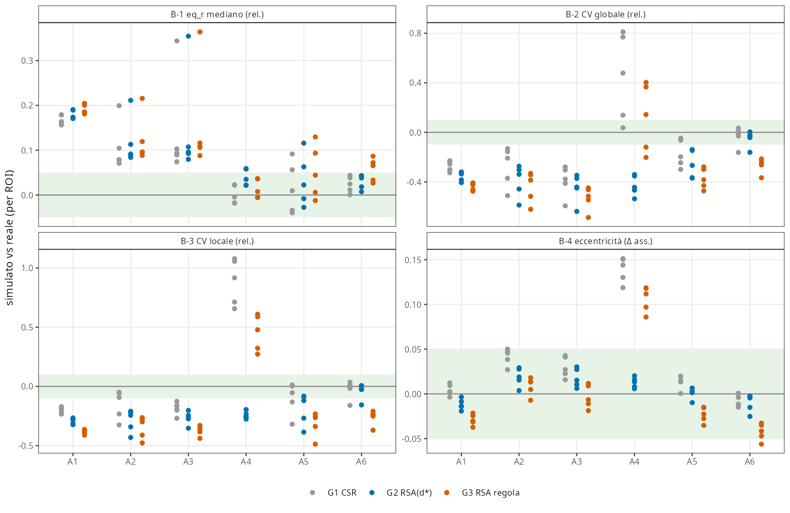
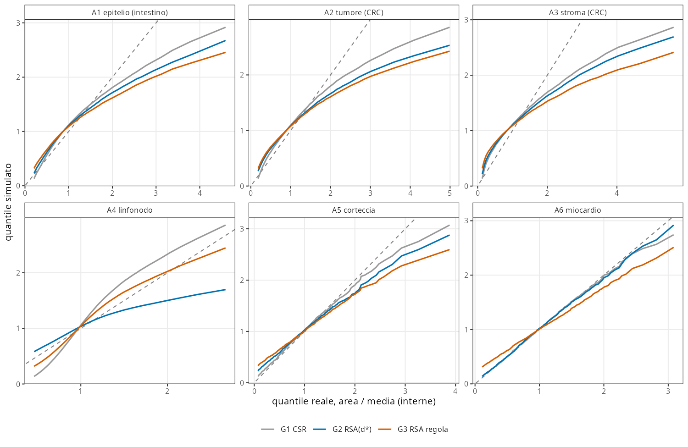
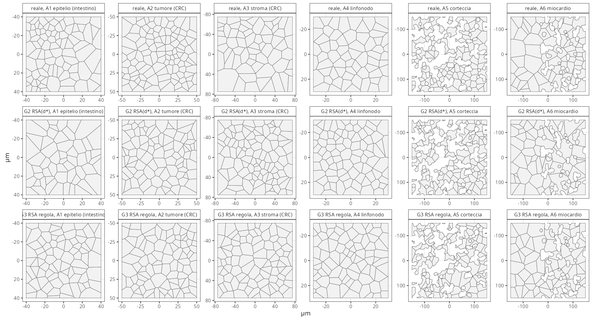
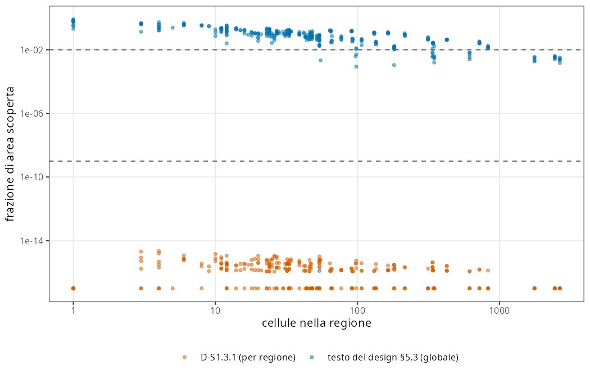
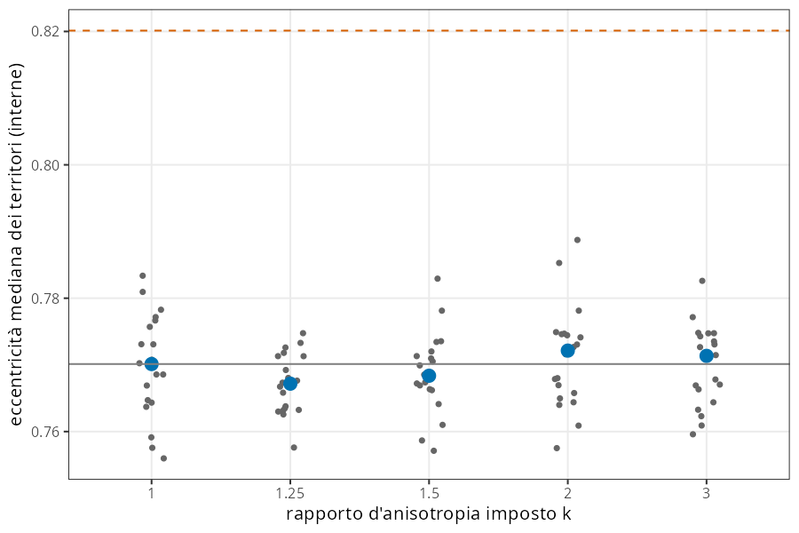
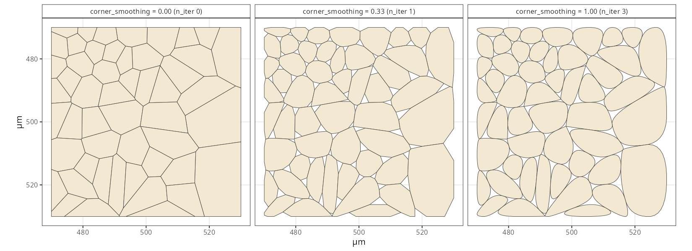

```{r setup}
.libPaths("~/2025.geo_spatialtrans/renv/library/linux-ubuntu-noble/R-4.6/x86_64-pc-linux-gnu")
RES <- "../results/S1.3"; FIG <- file.path(RES, "figures")
rd <- function(f) read.csv(file.path(RES, f), check.names = FALSE)
k <- function(d, digits = 3) knitr::kable(d, digits = digits, row.names = FALSE)
V <- rd("S1.3_verdicts.csv")
```

**Obiettivo unico.** `tessellate_voronoi()` in `R/04b3_tessellate_voronoi.R` (design §5.3): dai centroidi di `seed_centroids()` ai territori cellulari, cioè Voronoi per regione ritagliato sulla regione, frammenti riassegnati e smussatura opzionale. Nuclei, preset e orchestratore restano fuori.

**Sintesi.**

- **Software (C).**
  - Sugli ingressi sintetici e avversari: 286/286 asserzioni; 6/6 mutanti rilevati.
  - C-perf: 449 536 punti in 35.9 s e 1 076 MB, entro il budget di 150 s e 4 GB.
  - C-5 e C-6 (identità con le tabelle di R3) **falliscono**. La causa è un errore della mia pre-registrazione: la riassegnazione dei frammenti (D-S1.3.2) cambia anche le celle interne che ricevono un frammento, e R3 era calcolato con `deldir`, che sbaglia i tile con lati cortissimi.
- **Motore.** Il confronto pre-registrato (addendum C-10) non ha prodotto una scelta automatica: i cancelli K-2 e K-3 sono caduti per entrambi i motori, per cause indipendenti dal motore. Tutte le misure che discriminano favoriscono GEOS:
  - arbitro per semipiani: 25/26 tile corretti con GEOS, 1/26 con `deldir`;
  - geometria annodata contro geometria non annodata;
  - C-perf: 31 volte più veloce.

  **Luca ha scelto GEOS** (ROADMAP §6, revisione della decisione 6 del design).
- **Biologia (B).** 36/38 previsioni confermate. Le aree dei territori simulati falliscono in A1–A5 per qualunque generatore omogeneo, come previsto dai nulli di R3: il limite sta a monte, in `seed_centroids()` (BL-051/068). In A6 passano. L'eccentricità passa ovunque, A6 compreso, ma questo non è prova di fedeltà di forma (BL-064).
- **Controprove.**
  - CP-1 confermata: il testo del design (Voronoi globale) lascia scoperta in mediana il 9.4 % di una regione piccola; la soluzione per regione, 0.
  - CP-2 senza potenza (errore di disegno del controllo positivo). Il post hoc CP-2b mostra che il check di forma vede un'anisotropia solo da 2:1.
  - CP-3: Chaikin senza contenimento non crea sovrapposizioni ma uscite dalla regione.
- **Scoperta laterale.** Su questi territori le operazioni di sovrapposizione di GEOS (`st_union`, `st_intersection`) possono dare in silenzio risultati sbagliati, mentre i predicati restano corretti: è un rischio diretto per lo Step 2 (BL-069).
- **Verdetto:** chiusa con riserve.

# 1. Pre-registrazione

Approvata da Luca in chat il 2026-10-08 («approvo», scelte (a) su D-S1.3.1…D-S1.3.3). File: `results/S1.3/S1.3_preregistration.md`, commit `e2f32fc`, scritto prima di qualsiasi codice. Le previsioni del check B per G1–G2 sono ricavate dai nulli di R3 con `tools/S1.3_predictions.R`, eseguito prima del codice.

**Decisioni d'apertura.**

| id | Decisione | Motivo |
|---|---|---|
| D-S1.3.1 | Voronoi **per regione** | Il testo del design (Voronoi globale ritagliato sulla regione del centroide) lascia scoperte le zone di confine fra regioni: verificato in CP-1 |
| D-S1.3.2 | Frammento orfano → territorio della stessa regione con il confine condiviso più lungo | Area conservata, un POLYGON per cellula |
| D-S1.3.3 | Chaikin ∩ territorio originale; `n_iter = max(1, round(3·cs))` | Niente sovrapposizioni; con la formula del design cs < 1/6 non smussava |

**Addendum C-10** (`results/S1.3/S1.3_preregistration_addendum_C10.md`, commit `4ec1912`, scritto prima del confronto). Il benchmark esplorativo ha mostrato che `deldir` 2.0.4 scala come n², quindi il budget di C-perf era irraggiungibile. Luca: «un solo motore… confronto oggettivo, scegli tu le metriche, fatto il confronto documentiamo la scelta». Metriche (fissate da Claude su delega): cancelli di correttezza K-1…K-3, concordanza con arbitrato, robustezza, prestazioni; regola di scelta fissata prima.

**Deviazioni e correzioni dichiarate** (BL-059). Tutte avvenute prima dell'esecuzione ufficiale, salvo dove indicato.

1. Prova di fumo su I2, prima dell'addendum: due difetti di `deldir` nella riassegnazione dei frammenti (tolleranza 1e-7 µm sulla lunghezza condivisa, aggancio solo se l'unione resta multiparte).
2. Test C-4: per l'esagonale, «interne» = punti del reticolo con 6 vicini, non «non ritagliate». Avversari: 1 centroide nelle regioni rimaste vuote.
3. Prestazioni: nella riassegnazione dei frammenti i riquadri sono calcolati una volta sola (A1 r1: da 263 a 34 s). Stessi risultati.
4. Arbitro per semipiani per C-10a; riferimento reale ricalcolato dal pacchetto come sensibilità del check B.
5. *Dopo l'esecuzione ufficiale:* lo stadio C-10a sintetico aveva una regex sbagliata (0 avversari trovati), corretta e rieseguita.
6. *Dopo l'esecuzione ufficiale:* lo script d'analisi contava come FAIL i territori multiparte nel banco ROI, che la deviazione 3 pre-registrata ammette. L'analisi è stata allineata al testo.
7. *Post hoc dichiarati:* CP-2b (controllo positivo con semina regolare); verifica di copertura per punti e controllo delle coppie sui casi con C-2 fallito.

# 2. Check C — correttezza software

```{r checkC}
cc <- V[V$section %in% c("C", "C10") & !V$id %in% c("C-10c", "scelta"), c("id", "model", "metric", "value", "threshold", "outcome")]
names(cc) <- c("check", "motore", "metrica", "valore", "soglia", "esito"); k(cc)
```

```{r mutants}
k(rd("S1.3_mutants.csv"))
```

**Lettura.**

- **Ingressi sintetici e avversari.** Con GEOS ogni asserzione passa. La variante `deldir` fallisce C-2 in 4 asserzioni su I4: le aree tornano, ma l'unione dei territori è più piccola della regione di 3–4·10⁻⁴. La diagnosi: 639 coppie di tile `deldir` con interni sovrapposti per strisce di circa 1e-12 µm² (lati condivisi non coincidenti all'ultima cifra), contro 1 coppia con GEOS. Su questa geometria non annodata l'unione GEOS perde una cella intera (52.4 µm²).
- **C-5 e C-6 falliscono per un errore della pre-registrazione, non del codice.** Avevo scritto «le interne sono identiche a R3». Ma il territorio che riceve un frammento orfano può essere interno, e allora la sua area cresce. Fra le repliche nulle senza frammenti, 57/67 sono identiche a R3. Le altre 10, e lo scarto di 1.2e-6 sulle celle non coinvolte dei ROI reali, sono i tile con lati cortissimi che `deldir`, usato da R3, sbaglia (vedi l'arbitro).
- **C-2 sui nulli GEOS (15/1 800 FAIL) è un falso allarme dello strumento di misura.** Le verifiche:
  - copertura per punti: su 2.5 milioni di punti, 0 scoperti e 0 coperti due volte;
  - coppie: 27 coppie su 28 hanno sovrapposizione ≤ 9e-13 µm²;
  - l'unica coppia «da 340 µm²» (A3 r3 CSR rep 3) è un poligono restituito per errore da `st_intersection`: dei 2 000 punti campionati in quell'intersezione, tutti stanno in una sola delle due celle.

  Nel caso peggiore (A5 r5) Σ aree = area della regione entro 1.5e-9 µm², mentre l'unione «a cascata» perde 1 359 µm² e quella incrementale 1 443 µm². → BL-069, BL-070.

```{r coverage}
cv <- rd("S1.3_c2_coverage.csv"); k(aggregate(cbind(casi = 1, punti_0 = cov0, punti_1 = cov1, punti_2 = cov2, coppie = n_pairs, area_coppie = ov_area) ~ set + engine, cv, sum), 3)
k(rd("S1.3_c2_overlap_pairs_check.csv")[, c("case", "i", "j", "area", "n_pts", "in_both", "in_i", "in_j")], 3)
```

## Confronto dei motori (C-10)

```{r engines}
e <- rd("S1.3_engine_choice.csv"); k(e[, c("engine", "K1", "K2", "K3", "K_arb", "eligible", "cperf", "slope")], 2)
k(rd("S1.3_perf.csv"), 3)
k(rd("S1.3_c10a_arbitration.csv")[, c("set", "archetype", "roi_id", "model", "cell", "a_geos", "a_deldir", "a_hp", "ns_geos", "ns_deldir", "ns_hp", "min_edge", "geos_ok", "deldir_ok")], 8)
```


**Lettura.**

- **Concordanza.** Le 26 discordanze di C-10a stanno tutte su configurazioni quasi cocircolari, con un lato fra 1e-14 e 2e-5 µm. L'arbitro per semipiani in R puro, indipendente da entrambe le librerie, dà ragione a GEOS in 25 casi su 26. Nell'unico caso contrario (A4 p2, cella 2304) le aree coincidono e cambia solo il conteggio dei lati su un vertice degenere: in A4 i centroidi Space Ranger sono quantizzati sulla griglia a 2 µm (BL-075).
- **Agganci di ripiego.** 0 con GEOS e 4 con `deldir` sugli ingressi di `extract_regions()`. Nel banco ROI, dove la regione è una maschera MULTIPOLYGON a gradini di pixel, servono anche a GEOS: 40 contro 261 sui 40 ROI reali.
- **Esponenti di scala:** 0.93 per GEOS, 1.70 per `deldir`.
- **Regola dell'addendum.** Nessun motore eleggibile, perché K-2 (C-5) e K-3 (C-2 tramite unione) falliscono per entrambi per le ragioni sopra.
- **Decisione di Luca (2026-10-08): GEOS.** `deldir` resta solo in `tools/S1.3_variants.R`.

# 3. Check B — plausibilità biologica (A1–A6)

30 ROI, stessa maschera e stessa regola d'interna di R3. G1 = CSR, G2 = RSA(d\*), G3 = RSA con la regola di default ⅔·eq_r; 20 repliche per ROI. Verdetto per archetipo: PASS se la condizione vale in ≥ 4/5 ROI. Riferimento pre-registrato: tabelle di R3 (B-055…B-090).

```{r checkB}
b <- V[V$section == "B" & V$id %in% c("B1", "B2", "B3", "B4"), ]
w <- reshape(b[, c("id", "archetype", "model", "outcome")], idvar = c("archetype", "model"), timevar = "id", direction = "wide")
names(w) <- sub("outcome.", "", names(w)); k(w[order(w$model, w$archetype), ])
pr <- V[V$section == "B" & !is.na(V$prediction) & V$prediction != "", c("id", "archetype", "model", "value", "outcome", "prediction", "confirmed")]
k(pr)
```







```{r ks}
k(rd("S1.3_checkB_ks_nsides.csv"), 3)
sens <- V[V$section == "Bsens", ]; cat(sprintf("Sensibilita' (riferimento ricalcolato dal pacchetto con la regola dei frammenti): verdetti identici in %d/%d righe\n", sum(sens$confirmed == "TRUE"), nrow(sens)))
```

**Lettura.**

- **G2 (24/24 previsioni confermate).** L'eq_r mediano simulato è troppo grande in A1–A3 (+8…+35 %), e il CV globale e locale troppo basso in A1–A5 (−14…−64 %). Un processo omogeneo per regione non riproduce l'eterogeneità delle aree reali (BL-051/068): il limite sta nella semina, non nella tassellazione. In A6 G2 passa tutte le metriche, e la KS D sta al livello del rumore (0.026 contro 0.023).
- **G3 (regola di default, BL-050).** È più regolare di G2 in A3, A5 e A6 (8/8 previsioni d'ordine confermate) e **fallisce A6**, dove G2 passa. È un dato in più contro la regola ⅔·eq_r come default. Smentite le 2 previsioni di FAIL sull'eccentricità in A5 e A6: Δ = −0.035 e −0.056…−0.033.
- **A4.** La varianza del numero di lati reale (0.86) è riprodotta da G2 (0.85), non da G3 (1.40) né da CSR (1.77): l'impaccamento dei linfociti è regolare a corto raggio. Il CV delle aree resta però troppo basso con G2.
- **Sensibilità.** Con il riferimento ricalcolato dal pacchetto, cioè con la stessa regola dei frammenti del simulato, i verdetti sono identici in 48/48 righe. La convenzione dei frammenti sposta però i valori di riferimento: in A1 r1 il CV globale passa da 0.79 (R3) a 0.85 (BL-071).

# 4. Controprova

```{r cp}
k(V[V$section %in% c("CP", "D"), c("id", "model", "metric", "value", "threshold", "outcome", "prediction", "confirmed")])
```

## CP-1 — il testo del design §5.3 lascia buchi? (confermata)



Con il Voronoi globale ritagliato sulla regione del proprio centroide, il 93.7 % delle 300 regioni con 3–1 000 cellule resta scoperto per più dell'1 % (mediana 9.4 %). Con il Voronoi per regione nessuna regione supera 1e-9. D-S1.3.1 è sostenuta dai dati.

## CP-2 — potenza del check di forma (smentita; post hoc CP-2b)



CP-2 era mal costruito. Alla densità di A6, con d\* = 2.5 µm e una spaziatura di circa 32 µm, la semina è quasi un processo di Poisson, e una trasformazione affine di un processo di Poisson resta Poisson isotropo: l'eccentricità resta 0.767–0.772 per k = 1…3. Con una semina regolare (CP-2b, η = 0.4, post hoc dichiarato) l'eccentricità cresce in modo monotono (0.624 → 0.717), ma supera Δ = 0.05 solo da k = 2.

L'eccentricità del territorio di Voronoi è quindi una misura di forma debole: non vede anisotropie di posizione sotto circa 2:1, e non le vede affatto se le posizioni sono poco strutturate. Questo rafforza BL-064 (BL-073).

## CP-3 — smussatura



Senza contenimento, Chaikin non crea sovrapposizioni fra territori in nessuno dei 30 ROI (previsione smentita). I vertici concavi stanno sul bordo della maschera, quindi la smussatura spinge il territorio *fuori dalla regione*. Questo difetto lo intercetta C-7: il mutante M4 fa fallire 19 asserzioni. Con il contenimento, 0 sovrapposizioni. Le lacune a cs = 1 valgono 6.9–8.5 % dell'area per archetipo (mediana dei ROI), quasi indipendenti dal tessuto: descrittivo, senza riferimento biologico.

## Descrittivi

- **D-1 (BL-056).** Rapporto fra le aree dei territori al confine fra due regioni, seconda piazzata / prima: mediana 1.071 (min 0.85, max 1.32; 20 seed). Il valore previsto ≥ 1.1 è smentito: l'effetto di bordo dell'RSA sui territori è piccolo.
- **D-3.** La frazione di celle ritagliate cala con l'area della regione (Spearman −0.78).

# Verdetto

**Chiusa con riserve.**

Riserve:

1. C-5 e C-6 FAIL, per l'errore di pre-registrazione descritto in §2 (BL-074).
2. Le operazioni di sovrapposizione GEOS sono inaffidabili su questi territori: va gestito prima dello Step 2 (BL-069), e i check di partizione vanno misurati con predicati o copertura per punti, non con l'unione (BL-070).
3. I riferimenti R3 sono stati calcolati con un'altra regola dei frammenti (BL-071).
4. Il check di forma è debole (BL-073; BL-064 resta aperta).
5. Prestazioni del ritaglio su maschere a gradini di pixel: 0.8–39 s per ROI (BL-072).
6. Le metriche di area falliscono in A1–A5 per la semina (BL-051/068) e la regola di default fallisce A6 (BL-050).

# Revisione avversariale

Vedi la sezione aggiunta dopo la revisione.

# Riproducibilità

Commit dello stato eseguito: `72126a5` (script); risultati e report nel commit di chiusura.

```bash
cd ~/2025.geo_spatialtrans
bash R/testing/run_S1.3.sh                         # check C, mutanti, ROI, CP, prestazioni, analisi (~5 h; deldir 449 536 punti ~78 min)
Rscript --vanilla tools/S1.3_c2_coverage.R && Rscript --vanilla tools/S1.3_c2_pairs_check.R && Rscript --vanilla tools/S1.3_analysis.R   # post hoc dichiarati
Rscript --vanilla tools/S1.3_figures.R && quarto render reports/S1.3.qmd
```
